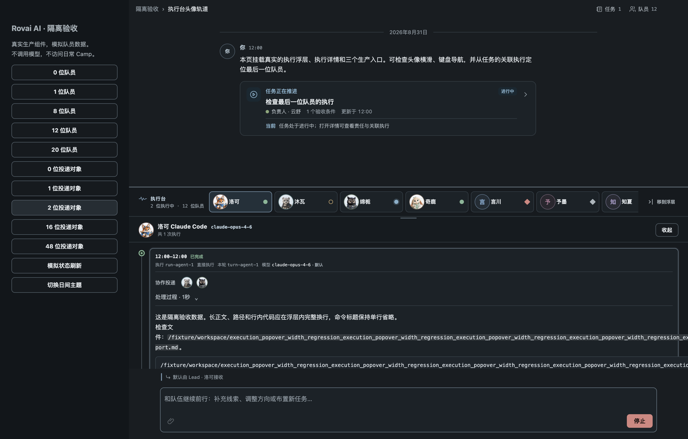
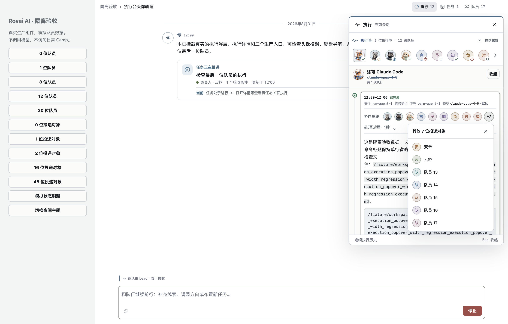

# 协作投递头像行验收

2026-08-31 的生产组件隔离验收截图，用于 PR 视觉对照，不是 UI 或 Runtime 合同。
截图使用模拟投影，无真实用户数据、模型请求或运行时执行。

复现：`ROVAI_KEEP_EXECUTION_AVATAR_FIXTURE=1 pnpm test:execution-avatar-rail`。
该命令打印临时目录，截图分别为 `delivery-avatars-bottom-night.png` 和 `delivery-overflow-list-day.png`。

底部执行台：重复投递到两位队员，去重为两个头像。

执行浮层：16 位对象保持单行，超出部分由 +7 展开。

