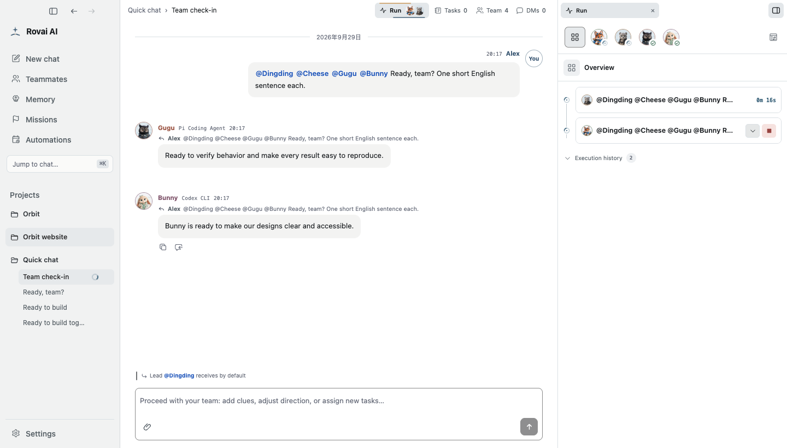
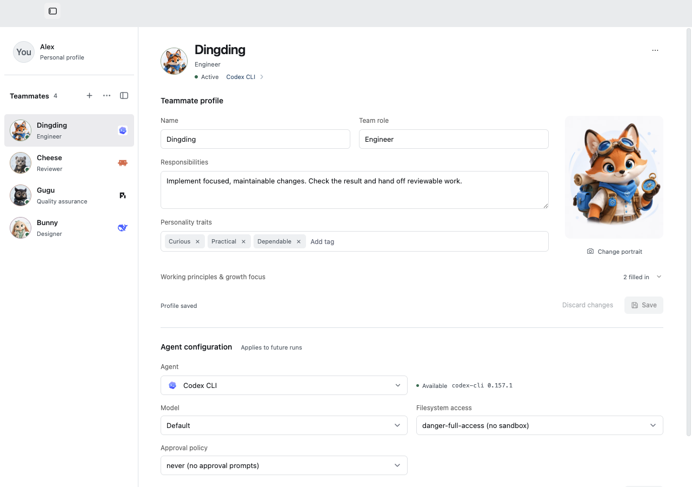
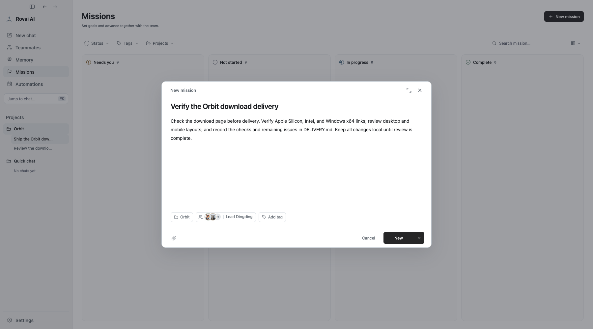
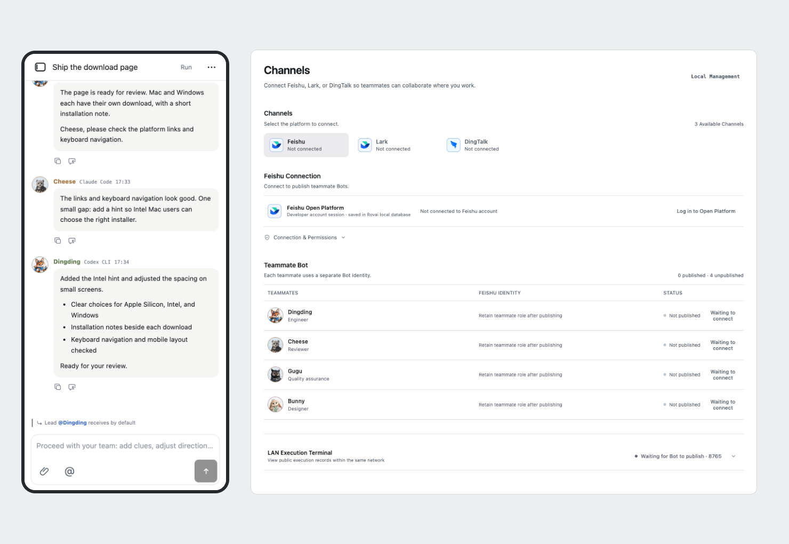
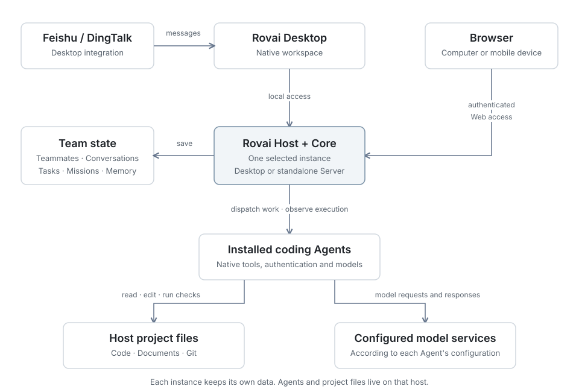

<div align="center">

# Rovai AI

### Assemble a team of agents that grows together.

A workspace for long-lived coding-agent teams.<br>
Bring your installed Agents into shared conversations, divide the work,<br>
inspect execution and file changes, and keep useful knowledge for the next task.

<p>
  <a href="https://github.com/murray17/rovai-ai/releases"></a>
  <a href="https://github.com/murray17/rovai-ai/releases"></a>
  <a href="LICENSE"></a>
  <a href="https://www.rust-lang.org/"></a>
  <a href="https://nodejs.org/"></a>
  <a href="https://linux.do/"></a>
</p>

<p>
  <a href="https://rovai.dev/"><strong>Website</strong></a>
  · <a href="https://rovai.dev/download/"><strong>Download</strong></a>
  · <a href="https://rovai.dev/docs/"><strong>Docs</strong></a>
  · <a href="https://github.com/murray17/rovai-ai/releases"><strong>Releases</strong></a>
</p>

<p><strong>English</strong> | <a href="README.zh-CN.md">简体中文</a></p>

</div>

<p align="center"><a href="docs/assets/readme/workspace-team-ready.png"></a></p>

## Work together, from the first request to the next task

Start with one teammate, then bring in another when the work needs a second perspective. Keep their roles, conversations, unfinished tasks, and useful agreements available when you return.

| Capability | What you can do |
| --- | --- |
| **[Lasting teammates](https://rovai.dev/docs/members.html)** | Give each teammate a name, role, responsibilities, and working principles. Choose their Agent, model, and permissions separately. |
| **[Shared conversations](https://rovai.dev/docs/collaboration.html)** | Address the right teammates, exchange findings, and hand off work. Open a separate one-on-one conversation when you need a focused discussion. |
| **[Visible execution](https://rovai.dev/docs/execution.html)** | Follow tool activity, respond to approvals, preview files, and inspect changes alongside the conversation. |
| **[Ongoing work](https://rovai.dev/docs/missions.html)** | Track larger goals on the Mission board, schedule recurring work, and save agreements as collaborative memory. |
| **[Skills and tools](https://rovai.dev/docs/skills.html)** | Use native Skills, configure Rovai collaboration tools, and connect MCP services supported by your Agent. |
| **[Remote access](https://rovai.dev/docs/remote.html)** | Return to your workspace through a browser. Connect Desktop teammates to external messaging channels. |

## Keep your teammates. Choose how they work.

A teammate's identity stays with the team across projects. An implementer and a reviewer can have different responsibilities, use different Agents, and keep their own ways of working.

Connect installed coding Agents such as **Codex CLI, Claude Code, Pi Coding Agent, DeepSeek Harness, and OpenCode**. Model choices, permissions, Skills, and MCP capabilities depend on the Agent and host platform.

<p align="center"><a href="docs/assets/readme/teammates-agents.png"></a></p>

[Teammates and configuration](https://rovai.dev/docs/members.html) · [Agents and models](https://rovai.dev/docs/agents.html) · [Platform compatibility](https://rovai.dev/docs/compatibility.html)

## Keep longer work in view

Use the Mission board for a goal you will return to: improving a download flow, preparing a release, or working through a project review. Choose a project and team, continue in its conversation, and inspect the accumulated file changes and delivery.

Tasks record responsibility; execution records show what ran. Finishing a run, completing a mission, and merging code are separate actions.

<p align="center"><a href="docs/assets/readme/missions.png"></a></p>

[Mission board](https://rovai.dev/docs/missions.html) · [Tasks and ownership](https://rovai.dev/docs/tasks.html) · [Scheduled work](https://rovai.dev/docs/automations.html) · [Collaborative memory](https://rovai.dev/docs/memory.html)

## Continue from another device

Enable Web access in Rovai Desktop, or run an independent Rovai Server on your own host. Open the workspace in a browser to continue the conversation and follow the work. Agents and project files stay on the host you connect to; separate instances keep separate data.

Rovai Desktop also connects to **Feishu and DingTalk**, so you can send requests and receive results in those channels. See the channel guide for setup and availability.

<p align="center"><a href="docs/assets/readme/remote-access.png"></a></p>

[Deployment and remote access](https://rovai.dev/docs/remote.html) · [Channels](https://rovai.dev/docs/channels.html)

## Get started

| Where you want to work | Start here |
| --- | --- |
| **On your desktop** | [Download Rovai Desktop](https://rovai.dev/download/) for macOS Apple Silicon, macOS Intel, or Windows x64. Follow the installation and upgrade notes for your release. |
| **On your own server** | [Install Rovai Server](https://rovai.dev/docs/server-install.html). Server packages, host requirements, release limitations, and setup are documented separately. |

1. **Prepare one Agent.** Install and sign in to a supported coding Agent on the host, then check it in **Settings → Agents**.
2. **Choose a teammate.** Set their Agent, model, and permissions. One teammate is enough to get started.
3. **Give it a small task.** Open a project conversation, ask the teammate to explain the project, and inspect the execution before assigning a change.

[Complete quick start](https://rovai.dev/docs/quickstart.html) · [Try a two-teammate workflow](https://rovai.dev/docs/collaboration.html)

## How it fits together

Rovai keeps the team's collaboration state and coordinates execution. The coding Agents perform the work using their own tools, authentication, and configured model services.

<p align="center"><a href="docs/assets/readme/architecture-overview.svg"></a></p>

Desktop and standalone Server share the Host implementation. Each instance has its own data and environment; connecting through a browser does not migrate or synchronize them. Channel integration is provided by Desktop.

[How work moves through Rovai](https://rovai.dev/docs/mechanism.html) · [Engineering architecture](https://github.com/murray17/rovai-ai/blob/main/docs/architecture/README.md)

## Documentation and development

| You want to… | Read |
| --- | --- |
| Learn to use Rovai | [English documentation](https://rovai.dev/docs/) · [中文文档](https://rovai.dev/zh/docs/) |
| Configure your tools | [Agents](https://rovai.dev/docs/agents.html) · [Skills](https://rovai.dev/docs/skills.html) · [MCP](https://rovai.dev/docs/mcp.html) |
| Connect another device | [Desktop Web](https://rovai.dev/docs/desktop-web.html) · [Server installation](https://rovai.dev/docs/server-install.html) · [Connection options](https://rovai.dev/docs/remote.html) |
| Build from source or contribute | [Developer guide](https://github.com/murray17/rovai-ai/blob/main/docs/development/README.md) · [Architecture](https://github.com/murray17/rovai-ai/blob/main/docs/architecture/README.md) · [Compatibility evidence](https://github.com/murray17/rovai-ai/blob/main/docs/runtime-compatibility.md) |

The engineering guides are primarily in Chinese. Start with the developer guide for environment setup and isolated development data, then:

```sh
git clone https://github.com/murray17/rovai-ai.git
cd rovai-ai
pnpm install --frozen-lockfile
pnpm dev
```

## Contributing

[Issues](https://github.com/murray17/rovai-ai/issues) and [pull requests](https://github.com/murray17/rovai-ai/pulls) are welcome. Include the Rovai version, host platform, and steps to reproduce when reporting a problem.

## License

[MIT](https://github.com/murray17/rovai-ai/blob/main/LICENSE) — free to use, modify, distribute, and use commercially.

## Community

Share your workflows, ask questions, and discuss Rovai in our WeChat group.

<p align="center">
  <a href="docs/assets/readme/wechat-group.png"></a><br>
  <sub>Scan with WeChat · Click the image to view full size</sub>
</p>
