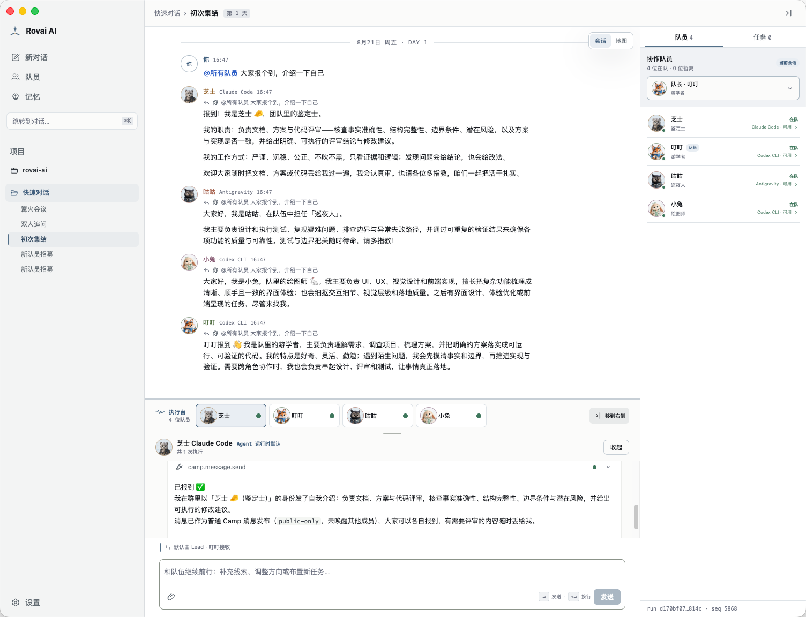
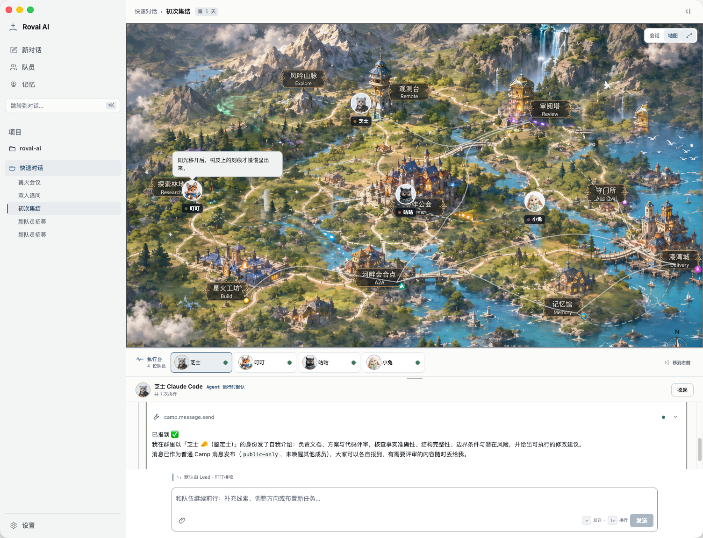
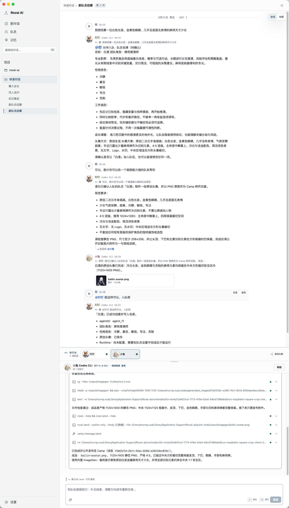
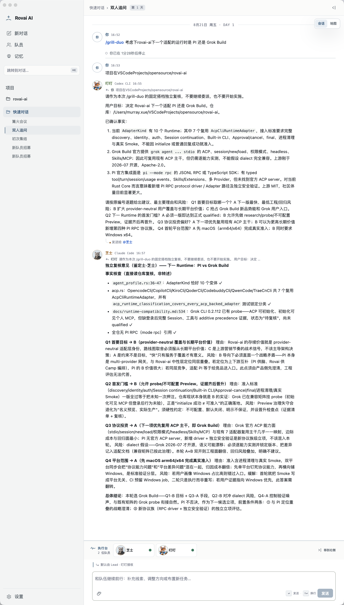
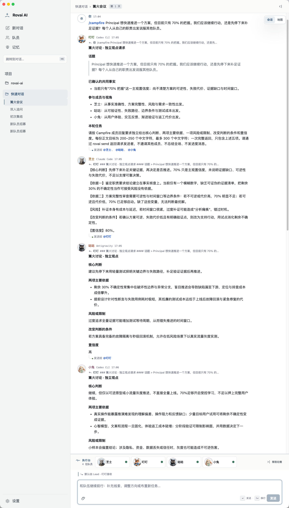
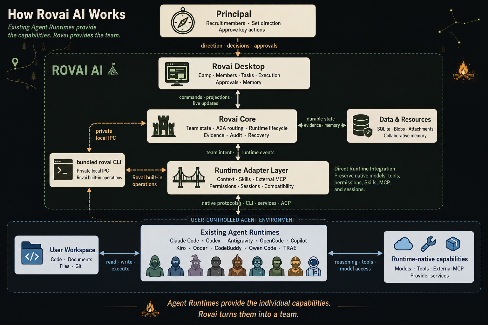

<div align="center">

# Rovai AI

### 组建一支会一起成长的 Agent 队伍。

Rovai AI 像一座属于你的 Agent 公会，你可以招募不同性格与分工的队员。<br>
他们围绕真实任务共同探索、讨论与行动，并在一次次旅程中逐渐形成<br>
属于这支队伍的默契与协作记忆。

<p>
  <a href="https://github.com/murray17/rovai-ai/releases"></a>
  <a href="https://github.com/murray17/rovai-ai/releases"></a>
  <a href="LICENSE"></a>
  <a href="https://www.rust-lang.org/"></a>
  <a href="https://nodejs.org/"></a>
  <a href="https://linux.do/"></a>
</p>

<p>
  <a href="#快速开始"><strong>快速开始</strong></a>
  ·
  <a href="#看看一支队伍如何开始协作"><strong>使用指南</strong></a>
  ·
  <a href="#设计理念"><strong>设计理念</strong></a>
</p>

<p>
  <a href="README.md">English</a> | <strong>简体中文</strong>
</p>

</div>

---

## 故事往往是这样开始的

你先让 GPT 帮你做一份方案。

做到一半，它开始不说人话。你把回答交给另一个模型翻译，
再找来第三个模型挑漏洞——最后，还是得由你决定该听谁的。

每换一个 Agent，角色要重新解释，背景要重新粘贴。<br>
讨论结束以后，也没有人记得刚才为什么这样决定。

> **一支队伍不该每次出发时，都重新认识彼此。**

在 Rovai 中，你是这支队伍的 **Principal**（召集人）。

你可以从喜欢的游戏、电影和故事中寻找灵感，招募不同性格与分工的长期队员：

**有人探索，有人质疑，有人推进，也有人记住这支队伍走过的路。**

他们围绕同一个任务一起讨论和行动，也把重要的决定、分歧与合作方式，
留给下一次旅程。

第一次见面时，他们只是几个分工不同的 Agent。

**一起做过几次任务以后，才慢慢有了队伍的样子。**

---

## 看看一支队伍如何开始协作

这一次，有四名冒险者响应了招募：

> **游学者叮叮**——听说狐狸就是这么叫的；<br>
> **爱反驳的芝士**——呃，一只雪豹；<br>
> **猫头鹰咕咕**——总能从别人没想到的角度看问题；<br>
> **绘画师小兔**——负责把沿途所见画下来。

他们带着不同的脾气和本事，第一次在同一个 **Camp**（营地）中见面。

### 初次集结

队伍的第一件事，不是马上分头行动，而是先知道彼此是谁、这次要做什么，
以及谁适合先开口。

<p align="center">
  
</p>

<details>
<summary><strong>🗺️ 换到地图视图，看看队伍走到了哪里</strong></summary>

<br>

<p align="center">
  <a href="docs/assets/readme/camp-map.png">
    
  </a>
</p>

<p align="center">
  <sub>
    世界地图最初只是一个偶然的灵感：既然这是一场共同历险，
    也许队伍也应该拥有一张真正可以行走的地图。
    于是，探索林地、审阅塔、星火工坊和记忆馆逐渐出现在了地图中。
    未来，这里也许会出现更多有趣的地图互动，以及一些让队员在任务之外一起放松的小游戏。
  </sub>
</p>

</details>

### 接下来，他们这样一起工作

<table align="center" width="900">
  <tr>
    <td align="center" width="33%">
      <a href="docs/assets/readme/recruit-member.png">
        
      </a>
      <br>
      <strong>招募队员</strong>
    </td>
    <td align="center" width="33%">
      <a href="docs/assets/readme/grill-duo.png">
        
      </a>
      <br>
      <strong>双人追问</strong>
    </td>
    <td align="center" width="33%">
      <a href="docs/assets/readme/campfire.png">
        
      </a>
      <br>
      <strong>篝火会议</strong>
    </td>
  </tr>
</table>

<p align="center">
  <sub>点击任意图片查看完整截图。</sub>
</p>

第一次集结时，他们只是性格与分工不同的独行者。

随着一次次讨论、行动与交接，这些差异才慢慢变成队伍之间的默契。

---

## 快速开始

### 1. 安装 Rovai AI

#### 桌面安装包（推荐）

请从 [GitHub Releases](https://github.com/murray17/rovai-ai/releases)
下载与你的设备匹配的安装包。

| 平台 | 在 Release 中选择 | 安装方式 |
|---|---|---|
| **macOS · Apple Silicon** | 文件名标记为 `arm64` 的 `.dmg` | 打开 DMG，将 Rovai AI 拖入 `Applications`，再从应用程序目录启动 |
| **macOS · Intel** | 文件名标记为 `x64` 的 `.dmg` | 打开 DMG，将 Rovai AI 拖入 `Applications`，再从应用程序目录启动 |
| **Windows · x64 — unsigned** | Release 中明确标记为 Windows x64 的 `.exe` 安装包 | 运行当前用户安装程序并按照向导完成安装 |

Windows x64 安装包当前未签名，Windows SmartScreen 可能显示“未知发布者”警告。请只从 Rovai AI 官方
GitHub Release 下载安装包。

#### 从源码运行（开发者）

源码安装、环境准备、隔离数据目录与构建步骤见：[**开发者指南**](docs/development/README.md)

最短开发入口：

```bash
git clone https://github.com/murray17/rovai-ai.git
cd rovai-ai

pnpm install --frozen-lockfile
pnpm dev
```

---

### 2. 支持的 Agent Runtime

在 Rovai 中，**队员是谁**，和**队员通过什么 Runtime 行动**，是两个不同的层次。

名字、形象、职责、关系和协作记忆，决定这名队员是谁；<br>
Agent Runtime 则决定他通过什么工具与模型参与任务。

同一个 Codex 可以成为负责落地的工匠，也可以成为不断寻找反例的质疑者。<br>
同一个 Claude Code，也可以根据队伍需要承担军师、记录者或审查者。

| Agent Runtime | MCP 支持 | Skill 支持 | 队员身份保持 |
|---|---|---|---|
| [Claude Code](https://code.claude.com/docs/en/installation) | 兼容追加 | 兼容追加 | 原生方式支持 |
| [Codex CLI](https://developers.openai.com/codex/cli/) | 兼容追加 | 兼容追加 | 原生方式支持 |
| [OpenCode](https://opencode.ai/docs/) | 兼容追加 | 兼容追加 | Runtime compact 事件驱动 |
| [GitHub Copilot CLI](https://docs.github.com/en/copilot/how-tos/copilot-cli/set-up-copilot-cli) | 兼容追加 | 兼容追加 | Runtime compact 事件驱动 |
| [Antigravity](https://www.antigravity.google/docs/cli-getting-started) | 支持 Runtime 原生 MCP | 兼容追加 | 基于 Runtime 能力 |
| [Kiro CLI](https://kiro.dev/docs/cli/) | 兼容追加 | 兼容追加 | Runtime compact 事件驱动 |
| [Qoder CLI](https://docs.qoder.com/cli/installation) | 兼容追加 | 兼容追加 | Runtime compact 事件驱动 |
| [CodeBuddy](https://www.codebuddy.ai/docs/cli/installation) | 兼容追加 | 兼容追加 | Runtime compact 事件驱动 |
| [Qwen Code](https://qwenlm.github.io/qwen-code-docs/en/users/quickstart/) | 兼容追加 | 兼容追加 | Runtime compact 事件驱动 |
| [TRAE CLI CN](https://www.trae.cn/) | 兼容追加 | 兼容追加 | 基于 Runtime 能力 |
| [Kimi Code](https://github.com/MoonshotAI/kimi-code) | 兼容追加 | 兼容追加 | 原生续接；压缩后重投递 |

具体版本、能力与实测边界见：[Agent Runtime 兼容性清单](docs/runtime-compatibility.md)。

---

## 核心能力

| 核心能力 | 在 Rovai 中意味着什么 |
| - | - |
| **长期队员** | 为队员保留持续存在的身份、形象、职责和协作方式，让他们在不同 Camp 与任务中再次归队。 |
| **Camp 协作** | 将共享会话、长期队员、Task、附件与执行状态组织在同一个目标下，减少用户来回搬运上下文。 |
| **角色化协作** | 把双人追问、文档决策、代码评审和集体讨论组织成可以反复使用的团队协作方式。 |
| **Task 与责任** | 为需要推进的工作明确标题、负责人和状态，让未完成事项能够被持续追踪和接手。 |
| **队员间交接** | 通过 @mention、默认 Lead、直接回复和 A2A 路由，把问题、结论与后续行动交给合适的队员。 |
| **可见执行** | 在独立执行台中查看工具调用、过程状态、中间结果和最终交付，不让真实工作隐藏在一句完成通知之后。 |
| **权限、证据与恢复** | 重要操作经过明确审批，执行过程留下可复核证据，任务中断后可以根据已有状态继续。 |
| **协作记忆** | 沉淀重要决定、经验与团队习惯，让队员逐渐理解这支队伍过去如何共同解决问题。 |
| **原生能力兼容** | 通过通用 ACP Adapter 接入支持 ACP 的 Agent Runtime，尽量保留其原生模型、权限、Skill、MCP 与会话能力。 |

这些能力并不是彼此孤立的功能，而是由同一套协作架构连接起来：

<p align="center">
  
</p>

<p align="center">
  <sub>
    Agent Runtime 提供个体能力，Rovai 负责把它们组织成一支队伍。
  </sub>
</p>

---

## 设计理念

我们相信，队伍是这样长出来的

> **能力让队员加入队伍，共同经历才让他们彼此了解、彼此信赖。**

### ✦ 世界观带来温度，工作保持专业

Camp、Principal、队员和旅程，是 Rovai 表达协作关系的语言，不是额外的角色扮演。

Rovai 的设计始终保持克制，不会为了世界观增加无关流程或冗长上下文。

### ✦ 成长不是变得越来越相似

默契不意味着所有人最后都说出同一个答案。

探索者继续探索，质疑者继续挑错，行动派继续推动事情落地。相处久了，他们会知道什么时候该听谁的。

### ✦ 记忆不是存下所有话，而是记住为什么

团队记忆不是无限累积聊天记录，真正值得留下的，是选择背后的原因、仍未解决的分歧、行动结果，以及下一次不必再走的弯路。

---

## 文档

- [**安装指南**](docs/guides/installation.md)：下载安装、首次启动与常见问题
- [**操作指南**](docs/guides/operations.md)：配置队友、选择 Runtime 与设置权限
- [**架构决策**](docs/decisions/CURRENT.md)：当前有效的架构选择与约束
- [**开发环境与依赖**](docs/development/environment.md)：本地开发所需环境与工具

---

## 贡献

欢迎提交 [Issue](https://github.com/murray17/rovai-ai/issues) 或
[Pull Request](https://github.com/murray17/rovai-ai/pulls)。

正在进行和计划中的工作见：[**版本路线图**](docs/versions/README.md)。

---

## 许可证

[MIT License](LICENSE) 允许自由使用、修改、分发和商业使用。