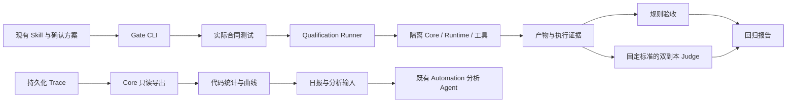

# 双轨执行评测

当前字段与判断规则由 [Execution Evaluation v13](../contracts/execution-evaluation-v13.md)拥有；操作见[开发指南](../development/evaluation.md)。

Core 是执行状态与元数据查询的权威，Rust 导出器只读取既有投影和去重事件。普通用户 CLI 经既有 Main IPC 获取受限快照；DailyAnalysisService 在用户显式配置后，用同一读取能力把日报准备到分析工作区。配置保存在 User Automation 受保护目录，不向受管 Runtime 暴露用户 socket 或全局查询工具。

日报逻辑位于共享 TypeScript 模块，供 Node CLI 与 Electron Main 复用；它负责日历边界、冻结、趋势、可比较性和分析输入。Main 准备器与原有 Automation 派发相互独立，准备受阻不能使普通定时任务停摆。分析 Agent 必须验证昨日报告身份再解释，不能把旧文件当成功。

Gate CLI 只编排既有测试与 Qualification 能力。用户终端的 `rovai app eval` 经 Main EvaluationHostService 提交固定动作；配置显式指向开发者源码与 Node 安装，按内容摘要验证后启动同一 Runner。Core、Skill Library、工作区和 MCP 按每个 Trial 隔离；仍使用当前主机的 Runtime 安装／认证，不宣称独立主机 Formal qualification。Runner 保存实际版本、预算、产物、终态、Ledgers 和 Evidence；规则与 Judge 各自保留证据，外层 Gate 不覆盖 HardOutcome。

评分配置与 Case 题目分别冻结。Judge 的显式 generic-task profile 保留 Process／Outcome 证据隔离，代码将逐项判定汇总为通用质量三个维度和协作状态分布。质量先汇总同一 Case 的计划重复，再使用固定 Case 权重；协作以计划 Trial 为统计单位。旧 Judge profile 不改写，评分升级不重新解释历史报告。没有汇总协作分，也不把运行健康次数接入任务质量。

共享 HTML 生成器只投影已保存 JSON，不拥有第二套统计事实。固定交互脚本受 CSP hash 限制，文本转义，证据链接限定报告目录且拒绝 symlink。每日分析完成记录是轻量文件记录：校验报告／输入摘要和引用存在性，保留全部提交，替换最新分析指针与 HTML；分析 Agent 不修改统计。生成、分析与页面分别失败时，已有证据保持可读取。

每周 CLI 与自动触发分开验收。macOS 受管 Agent 内启动子 Runner 的旧路径存在嵌套沙箱限制；Main 现在观察已有 AutomationRun，以 runId 去重并在宿主启动受限 worker。Agent 等待当前 Camp 专属回执再解释报告，不获得用户 IPC。取消与 App 关闭收口本次 worker 及后代；重启不重派发。具体边界见 [User Automation v4](../contracts/user-automation-v4.md)。每日 Host 准备统计文件、Automation 读取解释的路径保持。

第一版不增加执行来源／历史 build 数据列。代价是日报覆盖必须显式声明未知；后续若补 provenance，应独立设计所有入口及 A2A 继承，不能只补一列后回填推测。精确记忆计数也不在此阶段提前近似实现。
