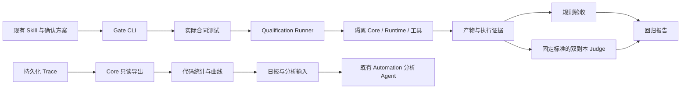

# 双轨执行评测

当前字段与判断规则由 [Execution Evaluation v1](../contracts/execution-evaluation-v1.md)拥有；操作见[开发指南](../development/evaluation.md)。

Core 是执行状态与元数据查询的权威，Rust 导出器只读取既有投影和去重事件。普通用户 CLI 经既有 Main IPC 获取受限快照；DailyAnalysisService 在用户显式配置后，用同一读取能力把日报准备到分析工作区。配置保存在 User Automation 受保护目录，不向受管 Runtime 暴露用户 socket 或全局查询工具。

日报逻辑位于共享 TypeScript 模块，供 Node CLI 与 Electron Main 复用；它负责日历边界、冻结、趋势、可比较性和分析输入。Main 准备器与原有 Automation 派发相互独立，准备受阻不能使普通定时任务停摆。分析 Agent 必须验证昨日报告身份再解释，不能把旧文件当成功。

Gate CLI 只编排既有测试与 Qualification 能力，不进入产品执行控制平面。Core、Skill Library、工作区和 MCP 按每个 Trial 隔离；仍使用当前主机的 Runtime 安装／认证，不宣称独立主机 Formal qualification。Runner 保存实际版本、预算、产物、终态、Ledgers 和 Evidence；规则与 Judge 各自保留证据，外层 Gate 不覆盖 HardOutcome。

每周 CLI 与自动触发分开验收。当前 macOS 不接受受管进程再次施加沙箱，Rovai Automation 内启动子 Runner 的路径受阻；本版不扩大 Host 到任意命令执行器。每日 Host 准备统计文件、Automation 读取解释的路径不需要嵌套 Runner。

第一版不增加执行来源／历史 build 数据列。代价是日报覆盖必须显式声明未知；后续若补 provenance，应独立设计所有入口及 A2A 继承，不能只补一列后回填推测。精确记忆计数也不在此阶段提前近似实现。
