# Rovai AI 多 Agent 协作架构

Rovai AI 是本地优先的多 Agent 协作工作台。队员拥有长期身份，在 Camp 中直接交流，通过各自的 Agent Runtime 执行工作，并将值得保留的经验沉淀为记忆。协作采用 **Peer 模式与轻量 Lead**：成员可以彼此委托和反馈，Lead 提供默认承接、组织与汇总。

| 章节 | 关注的问题 | 图 |
| --- | --- | --- |
| 一、协作模型与系统全景 | 长期队员、协作空间、Core 与原生 Runtime 如何组成系统？ | 01 系统全景架构 |
| 二、队员身份与 Runtime | 长期队员与执行引擎是什么关系？ | 02 咕咕的会话、Runtime 与记忆 |
| 三、Camp、Conversation 与 AgentRun | 共享讨论与独立会话如何共同承载执行？ | 03 会话与执行关系 |
| 四、A2A 通信与成果交接 | 如何寻址、委托、返回并交付成果？ | 04 A2A 调用与返回 |
| 五、协作组织与任务责任 | 如何选择协作方式、分配责任并交接成果？ | 05 协作组织与任务责任 |
| 六、一次 AgentRun 的生命周期 | 平台在什么时机准备能力、提供输入并承接执行结果？ | 06 加载与执行时序 |
| 七、平台内置 Toolkit | Skill、CLI 与 Core 如何配合提供平台能力？ | 07 Rovai CLI Toolkit 架构 |
| 八、动态上下文 | 每次 Run 如何获得所需信息，长会话如何持续接续？ | 08 三层引导与六层动态输入；09 长会话输入 |
| 九、记忆与队员成长 | 经验如何形成、复用、治理并指导后续实践？ | 10 记忆提报与持续演进 |
| 十、技术栈 | 桌面、协作内核、原生 Runtime 与本地存储如何连接？ | 11 技术栈架构 |

## 一、协作模型与系统全景

### 图 01：系统全景架构

Rovai 以长期队员为协作主体，通过 Camp 组织共同工作，并连接本机已有的 Coding Agent Runtime。

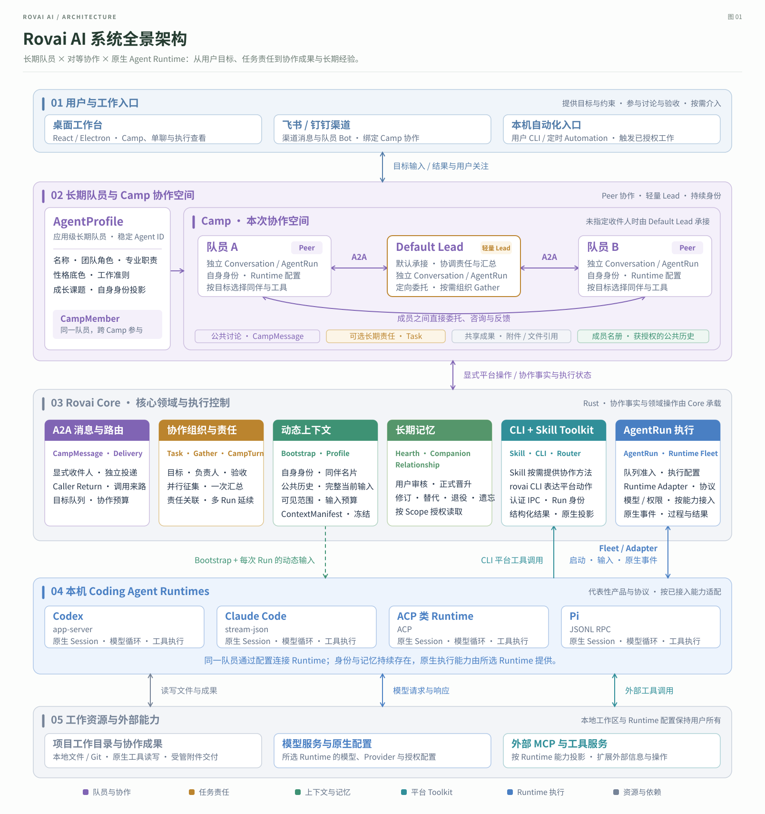

## 二、队员身份与 Runtime

### 图 02：咕咕的会话、Runtime 与记忆

咕咕可以参与不同会话、切换执行引擎，并在获授权的范围内沿用长期记忆。

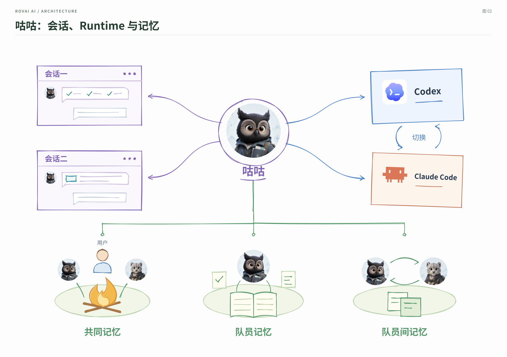

## 三、Camp、Conversation 与 AgentRun

### 图 03：三位队员协作完成 CSV 导出功能

同一轮协作中，A 负责方案与编码，B 提供原型，C 评审方案与代码。消息到达后，工作在接收方自己的 Conversation 中接续为新的 Run。

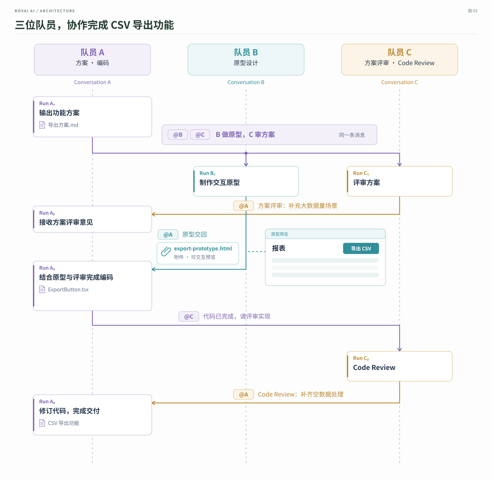

## 四、A2A 通信与成果交接

### 图 04：A2A 委托、成果交接与返回

叮叮请芝士评审方案，芝士再请咕咕复现边界问题。公共消息保留协作来路，定向投递推动接收者执行，成果沿调用关系逐级交回。

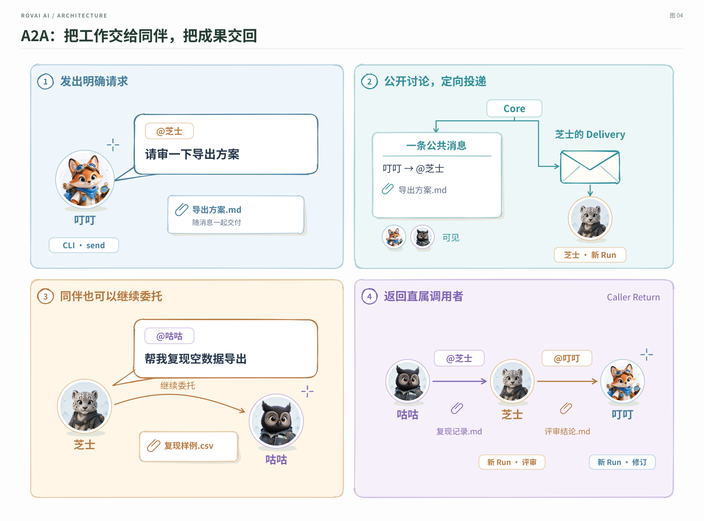

## 五、协作组织与任务责任

### 图 05：对等协作、长期责任与协作方法

以完成 CSV 导出功能为例，叮叮担任本次 Default Lead，芝士负责评审，咕咕负责验证。三位同伴直接协作，根据工作的持续性与组织需要选用 Task、协作 Skill 和 Gather。

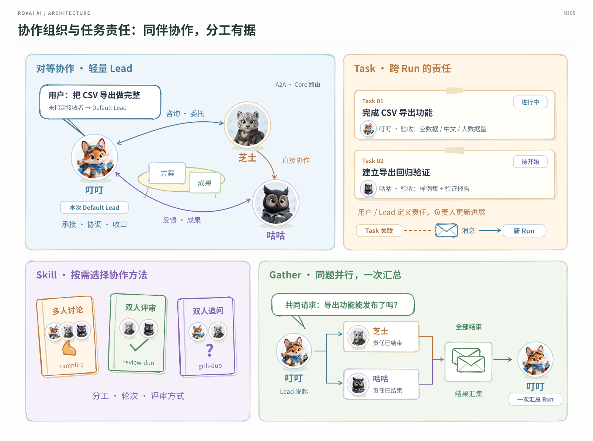

## 六、一次 AgentRun 的生命周期

### 图 06：加载、执行与会话接续

以咕咕使用 Codex 处理 A2A 请求为例。请求经收件人 FIFO 队列、Dispatch Pump 与 Scheduler 进入执行；Runtime Fleet 取得兼容的 Warm Host，或冷启动 Host，并为本轮绑定新的 Lease。Run 结束后，静默且可复用的常驻 Host 回到 IdleWarm；Native Session 按自身兼容条件继续接续。

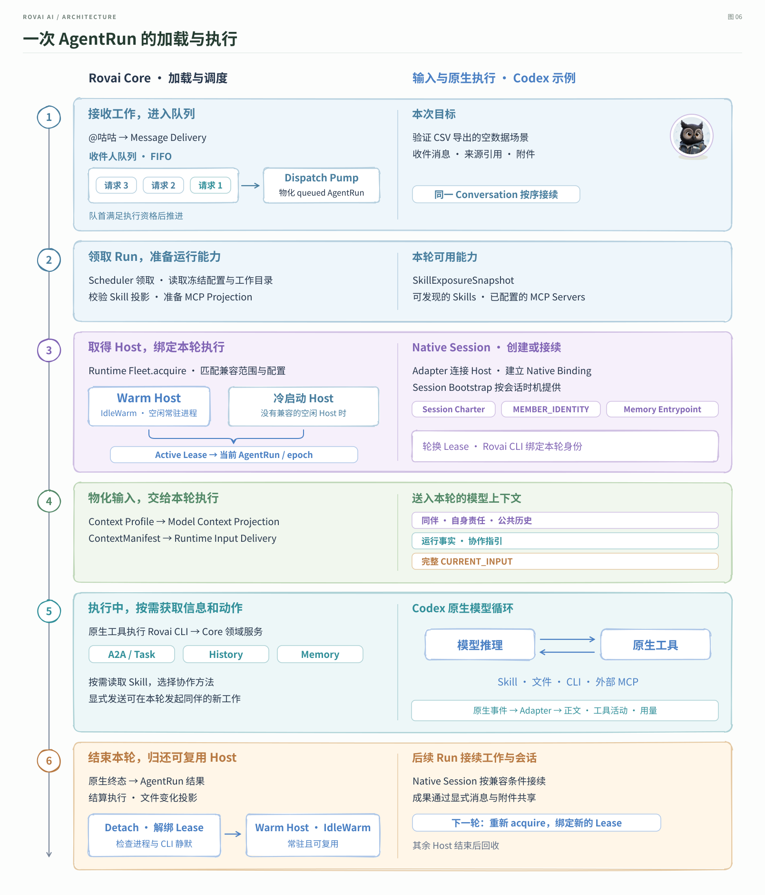

## 七、平台内置 Toolkit

### 图 07：Rovai CLI 平台内置 Toolkit

Skill 经原生发现路径提供协作方法，Agent 使用 `rovai` CLI 调用平台动作。经认证的本地 IPC 将请求交给 Core，由领域服务执行并返回适合 Agent 使用的结构化结果。

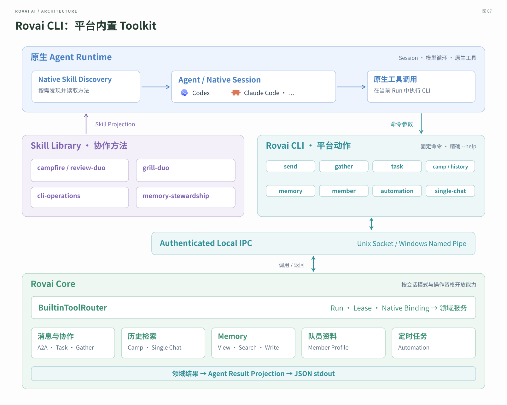

## 八、动态上下文

### 图 08：从 Session Bootstrap 到动态上下文

Session Bootstrap 在顶部展开会话约定、队员身份和记忆入口三层；每次 Run 的动态输入再按职责展开六层。Context Profile 决定可见范围和输入预算，ContextManifest 记录实际选择，本次输入完整保留。

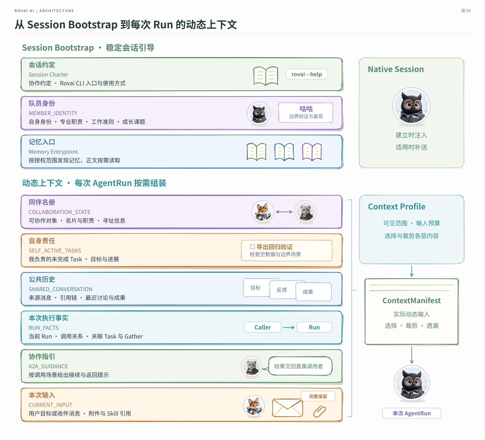

### 图 09：长会话中的稳定引导与动态输入

普通成员会话在建立时获得 Bootstrap，后续 Run 持续接收新的动态上下文。对于已接入原生压缩信号的 Runtime 路径，平台在后续受控输入中补送稳定引导，接续同一个 Native Session。

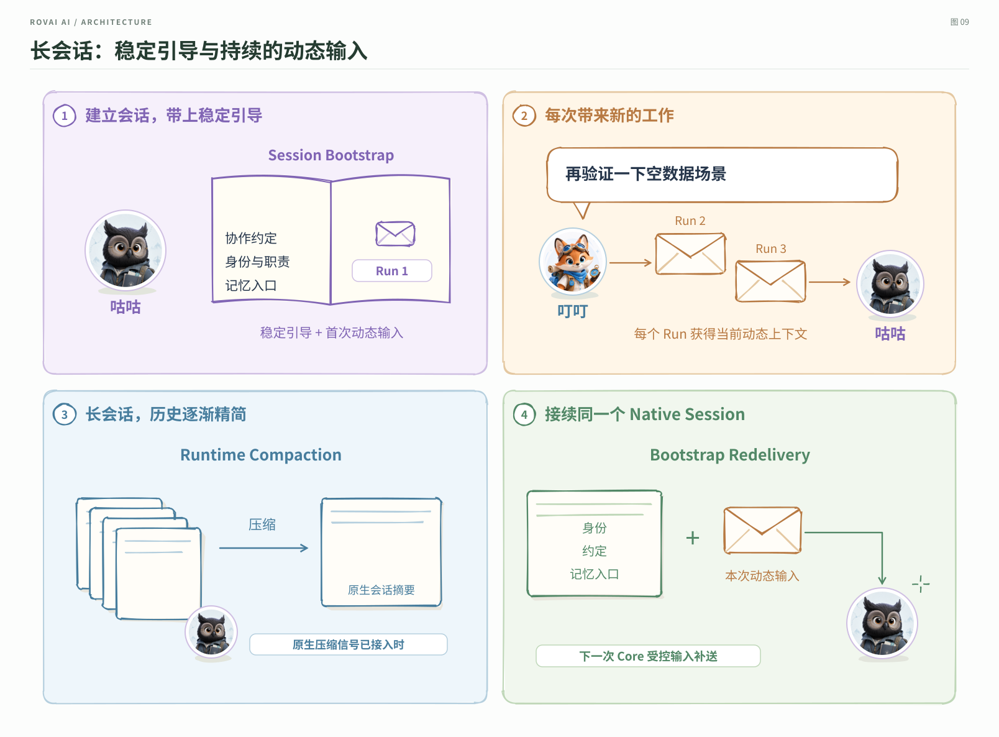

## 九、记忆与队员成长

### 图 10：记忆的主动提报与持续演进

记忆在“实践形成经验 → 主动提报与演进 → 按需读取 → 再次实践”之间形成闭环。队员对照完整 Scope 提报新增或修订，Hearth 候选保留手动晋升审核；修订、替代和显式遗忘反映新的经验判断，成长课题为后续实践提供方向。

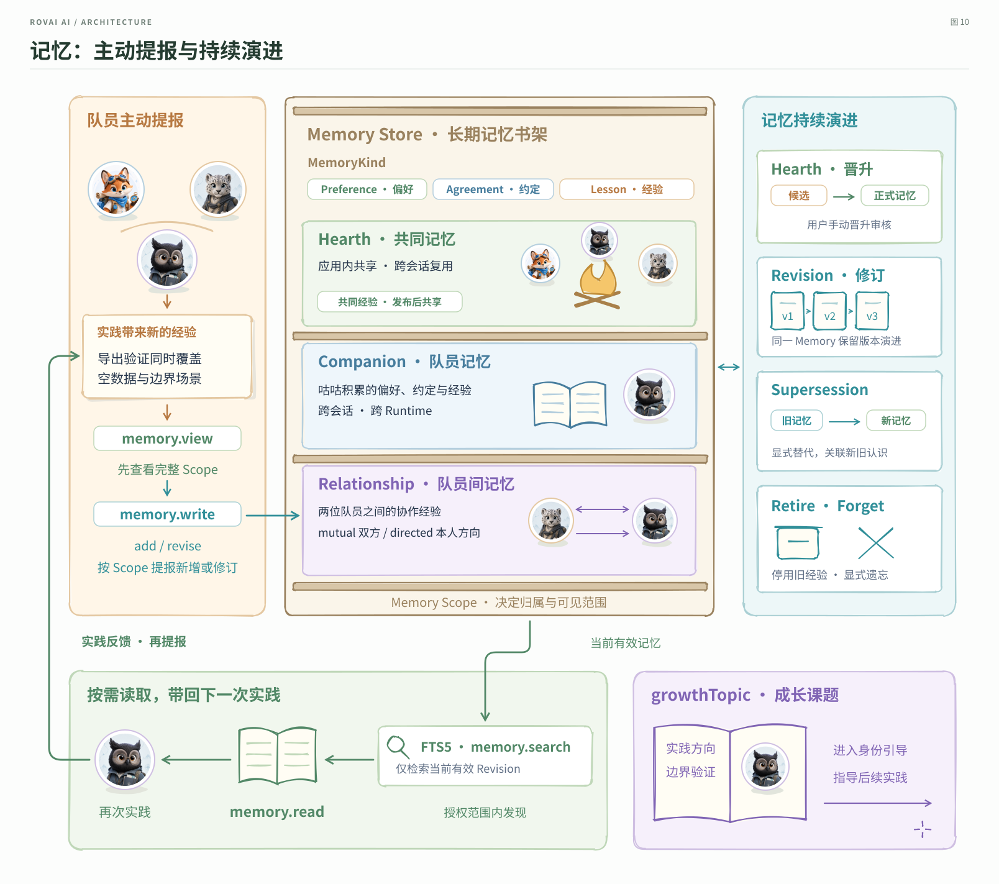

## 十、技术栈

### 图 11：Rovai AI 技术栈架构

Electron 桌面连接本机能力与 Rust 协作内核，Core 通过 Adapter 对接不同原生 Agent 协议。SQLite、全文索引与受管文件承载本地数据，原生 Runtime 连接模型、工具、项目目录与外部 MCP。

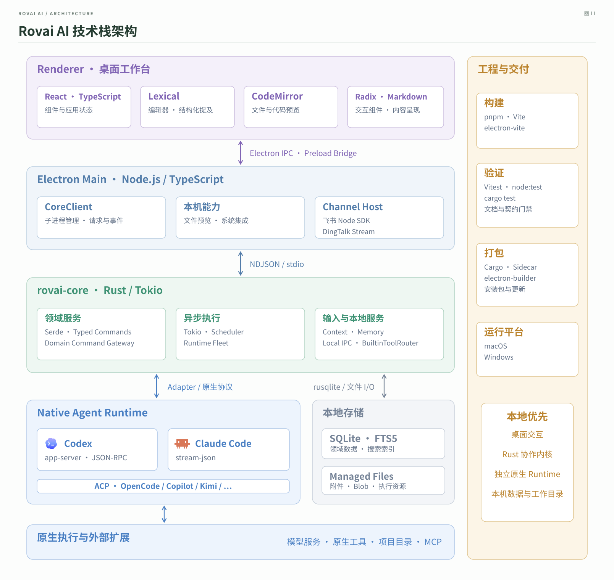
