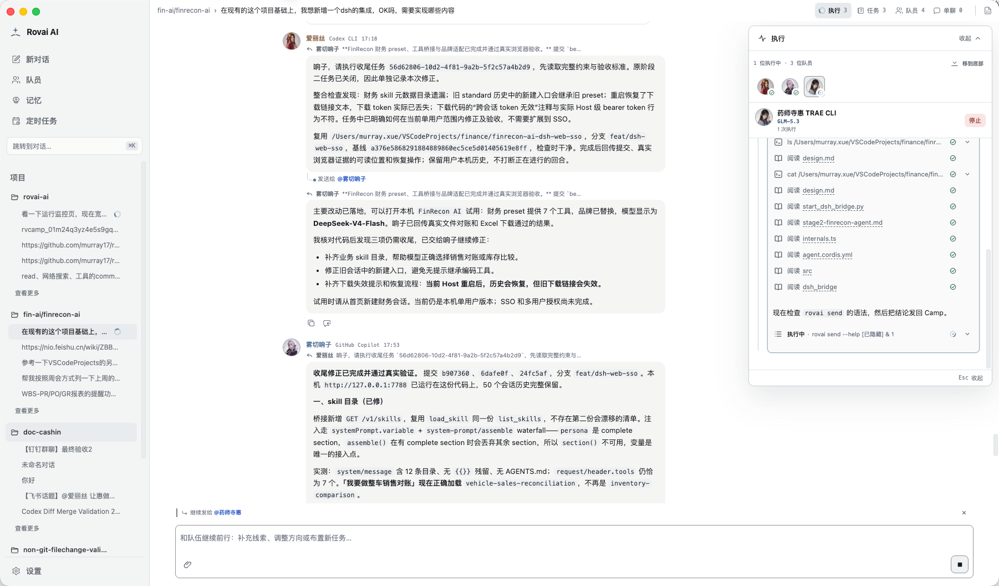
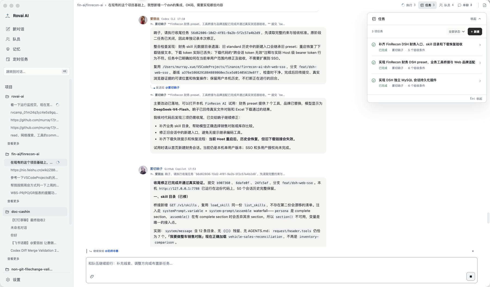
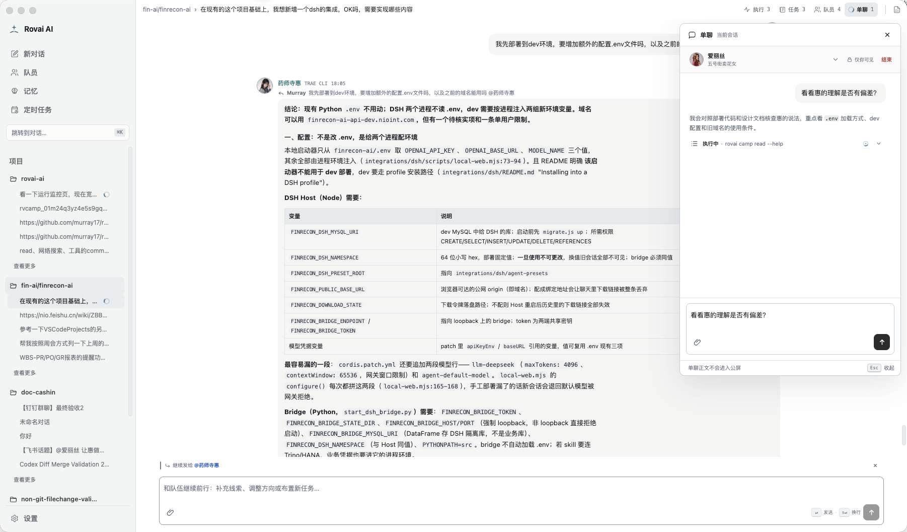
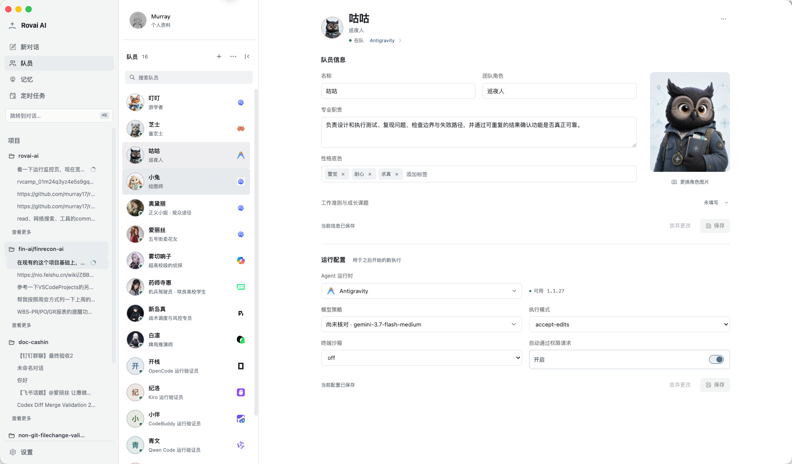
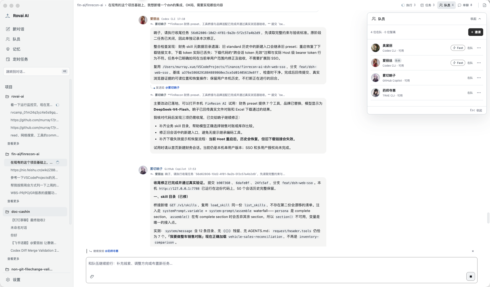
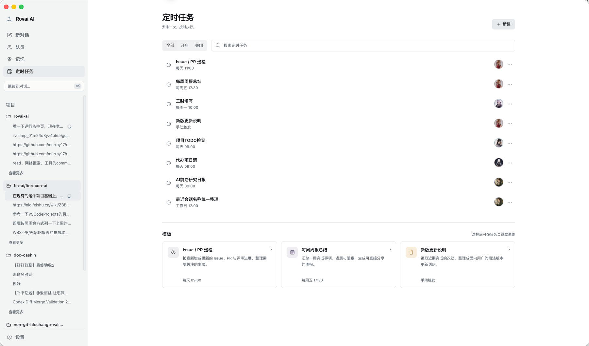
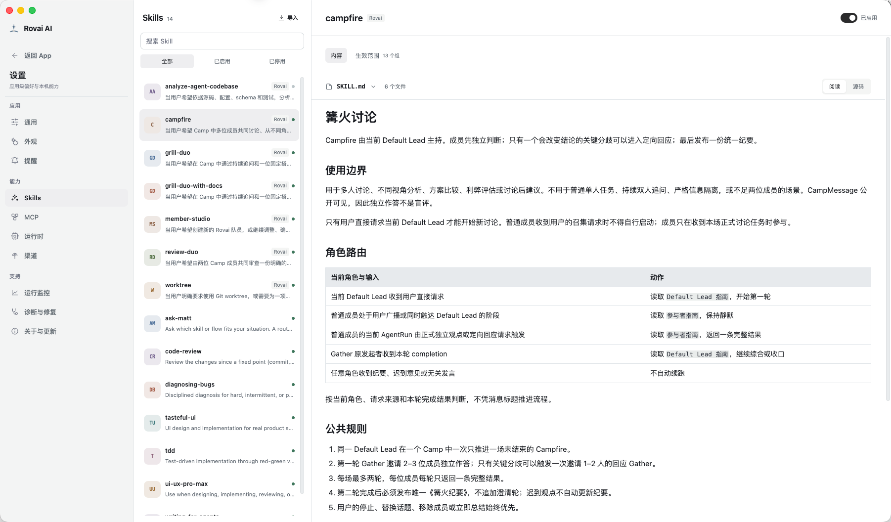
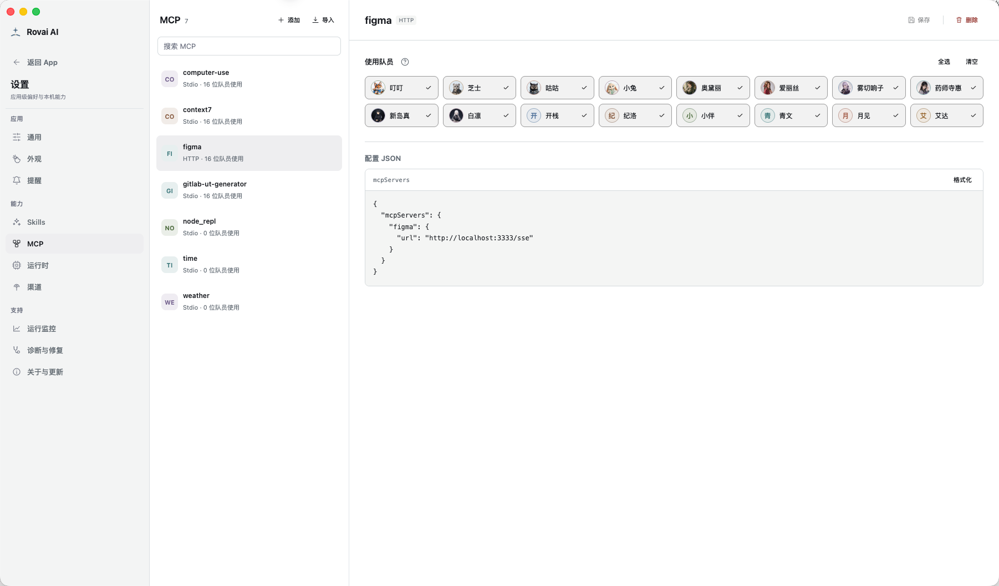
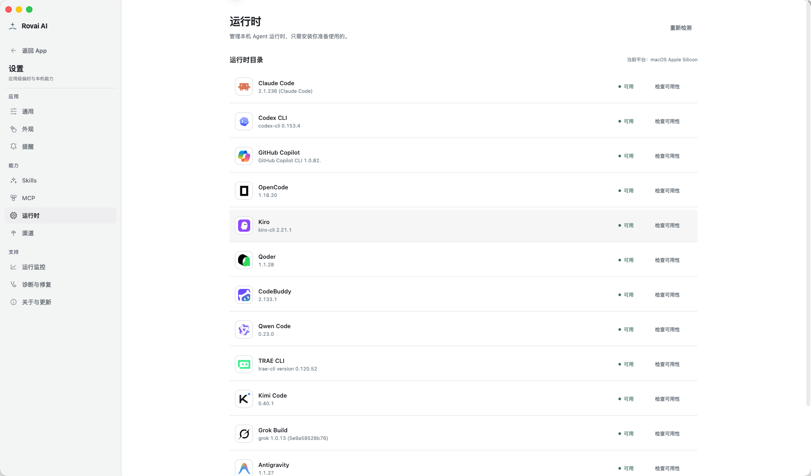
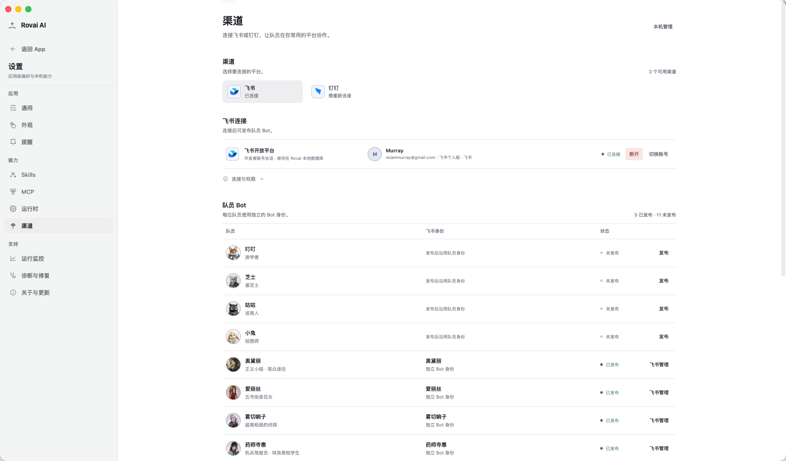

# Rovai AI 产品展示

Rovai AI 将长期队员、共同会话、任务责任与原生 Agent 执行组织在同一个桌面工作台中。以下界面展示多队员如何围绕实际项目协作，以及队员、自动化、Skills、MCP 和运行时的日常管理。

[下载安装](guides/installation.md) · [操作指南](guides/operations.md) · [系统架构图解](architecture/system-views.md)

## 协作工作台

在共同会话中提出目标，队员通过提及直接交接工作、反馈检查结果。右侧执行台展示各成员的运行状态、工具调用与执行细节，便于在讨论和实际操作之间切换。

## 任务责任

任务把目标、负责人、验收条件和完成状态保留下来。成员可以在持续讨论中承接、检查与关闭任务，让跨轮次协作有明确的责任和交付入口。

## 会话内单聊

在共同工作期间，可以与指定队员开启独立单聊，核对理解、讨论方案或补充背景。单聊拥有独立的消息与执行空间，内容不会自动发布到共同会话。

## 长期队员与会话成员

队员保留自己的名称、团队角色、专业职责、性格与工作准则。运行时、模型及权限另行配置，让长期身份与执行引擎可以分别调整。

进入具体会话后，可以邀请队员、查看当前参与者，并为默认承接与协调工作设置队长。不同队员可以使用不同的原生 Agent 运行时参与同一项工作。

## 定时自动化

将需要重复开展的工作交给指定队员，按时间安排执行；也可以保留手动触发的任务。Issue／PR 巡检、每周总结与更新说明等模板提供常见工作的起点。

## Skills 与 MCP

Skills 将讨论、追问、评审等协作方法沉淀为可复用的工作指引。平台支持导入、启停、阅读 Skill 内容与管理生效范围。

MCP 为队员接入外部工具与信息来源。统一管理服务配置，并选择使用该能力的队员。

## 运行时管理

集中查看本机 Agent 运行时的安装版本与可用状态，并按需检查可用性。队员可以按工作需要选择已接入的执行引擎。

## IM 渠道连接

通过飞书、钉钉连接队员，在常用的沟通渠道中发起和跟进工作。渠道工作区统一管理账号连接、队员 Bot 与发布状态。

