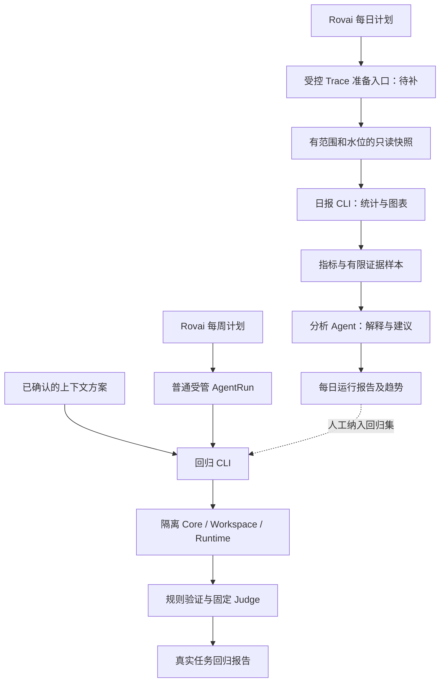

# 双轨评测与每日 Trace 分析

2026-09-10 实施路由：当前规范已转入 [Execution Evaluation v1](../contracts/execution-evaluation-v1.md) 与[操作指南](../development/evaluation.md)，实施事实见[v1.57](../versions/v1.58/README.md)。下文保留实现前调研与候选推演，不回写成实测收益。

本文是[四项治理愿景](agent-governance-vision.md)第二项的源码调研与候选设计。源码基线为
`4235e68a446addd4284e9f58e084a4e6ea821be6`；本文未运行真实 Runtime 评测，也未读取用户日常执行
数据。字段与函数核对属于静态证据，不能当作能力提升、运行成功或覆盖完整的证明。

已确定方向是 Gate 前／每周真实任务回归，以及每日分析前一自然日 Trace。2026-09-10 已确认 Gate
按影响面分为通用集与 Skill 专项小集；具体分流规则、指标口径、CLI、Case 与通过标准仍是候选设计。
本文的源码审计以以上固定基线为准；设计与开发草稿均不代表新增能力已经验收或接入产品。
第一版业务指标保持 Run、A2A、记忆和工具四类，其他维度只列为候选。

## 1. 结论与现有证据

| 结论 | 状态 | 源码依据 | 限制或缺口 |
| --- | --- | --- | --- |
| 已有每日、每周和手动计划，领取后建立普通 Camp/AgentRun | 已确认 | [AutomationSchedule 与 AutomationService](../../crates/rovai-core/src/automation.rs) | 不是任意 shell job；应用退出或休眠时不会常驻执行，恢复按 missed 处理 |
| 计划按设备本地时区求值 | 已确认 | 同文件 `next_run_at` 相关求值使用 `Local`；[当前合同](../contracts/scheduled-automation-v1.md) | Schedule 本身没有独立 IANA 时区字段，日报统计时区需另行冻结 |
| 普通用户 CLI 能查看、观察和导出指定 Run | 已确认 | [User Automation](../contracts/user-automation-v1.md)与[CLI](../../crates/rovai-core/src/bin/rovai.rs) | 没有按日期批量枚举所有 Run 的现成入口；受管 Runtime 明确禁止 `rovai app` |
| Run 有权威状态、时间、等待原因和结构化失败 | 已确认 | [AgentRunDiagnosticView](../../crates/rovai-core/src/read_model.rs)、[RuntimeFailureView](../../crates/rovai-core/src/runtime_failure.rs) | 状态成功只代表 Run 结算，不代表用户任务验收；最新行不等于任意历史时点的状态 |
| A2A 有 Delivery、派发阶段、等待原因、重试代次和终态事件 | 已确认 | [MessageDeliveryService](../../crates/rovai-core/src/message_delivery.rs) | 显式 retry 会复用 Delivery 并清空旧终态，不能只读当前行统计历史失败 |
| 工具有去重 Evidence 和版本化 Canonical Activity | 已确认 | [ExecutionEvidenceService](../../crates/rovai-core/src/execution_evidence.rs)、[CanonicalRuntimeActivity](../../crates/rovai-core/src/canonical_activity.rs) | start/progress/terminal 不是三次调用；同操作可有多个 classifier 投影；未知工作不被自动补全 |
| 记忆读取与正式修订有基础证据 | 已确认 | [读取证据](../../crates/rovai-core/src/memory_retrieval.rs)、[正式 Revision](../../crates/rovai-core/src/memory.rs) | 准确读取去重与统计仍待第一／四项；日报先标不可用，不提前使用粗略计数 |
| ContextManifest 保留选择、遗漏、投递、Skill/MCP digest 与版本 | 已确认 | [ContextManifestView](../../crates/rovai-core/src/read_model.rs)、[ContextService](../../crates/rovai-core/src/context.rs) | 这些是 Core 可见证据，不自动赋予分析 Agent 读取所有正文的权限 |
| Usage 已有稀疏汇总、覆盖率和趋势呈现 | 已确认 | [MonitoringService](../../crates/rovai-core/src/monitoring.rs)、[RuntimeUsageChart](../../apps/desktop/src/renderer/src/RuntimeUsageChart.tsx) | 只覆盖 Usage；现有 Snapshot 是滚动 24h/7d/30d，不能直接当作配置时区的昨日统计；派生数据保留 45 天 |
| 真实 Runner、分离 Judge、版本比较与配对基础已经存在 | 已确认 | [Qualification Runner](../../scripts/qualification-runner.mjs)、[Judge Views](../../scripts/lib/qualification-judge-views.mjs)、[Tool-use Judge](../../scripts/lib/qualification-tool-use-judge.mjs)、[Benchmark Compare](../../scripts/benchmark/evaluation/comparison.mjs) | Runner 的 Team 配置仍在源码中冻结；Team/Solo 配对只允许 coordinationMode 变化，需最小配置与实验定义扩展 |
| 合同评测配置与实际代码存在漂移 | 已确认 | [Current Contract Profile](../../scripts/benchmark/profiles/current-contract-conformance.mjs)、[当前 DB 常量](../../crates/rovai-core/src/db.rs) | Profile 为 v1.28/schema 69，基线 Core 为 v1.56/schema 98；Formatter/Manifest 为 23，部分条目仍写 22 |
| 合同条目结果没有逐项绑定执行证据 | 已确认 | [runCurrentContractConformance](../../scripts/benchmark/execution/current-contract-runner.mjs) | 全组 `cargo test --lib` 退出码映射到全部条目，且条目包含 Main target 测试；源码中存在测试不等于本次实际执行 |
| 所有历史 Run 的精确 Rovai build 和实验来源都可直接取得 | 未知 | 已核对 Run/Diagnostic/Manifest/Automation 的公开形状 | `AgentRun.version` 是实体版本，workspace Git HEAD 是用户项目版本，二者都不是 Rovai build；缺失时不能用当前安装版本回填 |

因此最小增量是受控数据出口、确定性日报聚合与报告、上下文对照 Profile 及专项 Case，以及现有评测
证据绑定的修正。调度、状态机、证据仓库、Judge 和报告入口继续复用。

## 2. 调度、CLI 与授权边界

建议保持两个 CLI 工具入口；以下是候选命令形态，尚未实现：

```text
node scripts/context-regression.mjs run --plan <frozen-plan.json> --output <private-report-dir>
node scripts/daily-trace-analysis.mjs build --source <authorized-snapshot>
    --date <YYYY-MM-DD> --timezone <IANA-zone> --output <private-report-dir>
```

前者编排现有 Runner、规则检查和 Judge；后者仅消费持久化证据快照，生成指标、样本包、图表与报告。
解释由定时任务的分析 Agent 完成，或使用同一冻结包调用显式配置的解释 Adapter；两者都不能重算
权威指标。现有 `qualification:run`、`qualification:judge`、`qualification:tool-use-judge`、
`benchmark:compare` 可作为内部实现，不应把当前 Team/Solo CLI 伪装成已支持上下文对照。



现有 Automation 派发普通 AgentRun，不是直接运行 shell。自动化 Agent 不能通过 `rovai app` 绕过
用户级诊断边界。每日链路需补一个窄的 Core-owned 只读快照／汇总出口，并明确它如何接入已授权
的报告配置；受管 Agent 只能通过受限 Built-in 发起该报告操作或消费宿主已准备的包，不获得任意
SQL、全量日志、跨 Scope 正文或通用 User Automation 权限。这个接口的模型可见输出也进入上下文 Gate。

回归 CLI 在独立工作区和显式 data-dir/Skill Library 中运行，不能连到日常 Core 写入；Runtime
在当前受管环境内能否启动所需隔离子进程，仍须按平台做实际准入验证。若平台不支持，报告 blocked，
不通过移除隔离或借用日常状态降级运行。

Rovai 计划时间沿用设备时区；统计窗口采用报告配置的 IANA 时区，两者都写入报告。需要任意时区
精确触发时另行评估 Schedule 扩展，不能假设现有字段已支持。日报缺跑留下缺口；受控手动补算只
读取已有记录，绑定明确日期，不补执行用户任务。

## 3. 日报的时间、来源与去重口径

### 时间与快照

- 报告日 D 使用配置时区的 `[D 00:00, D+1 00:00)`，转换成 UTC 半开区间；不固定减 24 小时，
  以正确处理夏令时。定时运行以 scheduled occurrence 为日期锚点，延迟执行不静默换成另一日。
- 保存 `windowStartUtc/windowEndUtc`、`timezone`、`asOf`、Core snapshot/global sequence 与完整性。
- 昨日流量按其实际发生时间统计；存量状态明确标为“截至 asOf”，不冒充昨夜零点快照。
- 按日创建／接纳的 cohort 与按日结算的流量是两种视图，不能拿昨日新开 Run 数作昨日所有结束
  Run 的成功率分母。第一版 Run 只画数量及存量；A2A 使用下面明确的 cohort 口径。
- 迟到证据、跨天结算或重算产生新的报告 revision，引用原报告和同一源窗口；旧报告不覆盖。

### 来源排除

优先以独立评测 data-dir/installation、Trial/Case 身份和配置中明确的分析／回归 Automation ID
识别来源，沿 CampTurn/root AgentRun 关系排除其全部 A2A 与派生 Run。普通生产定时任务仍属于真实
使用，不能把所有 Automation 一概排除。不能靠 Camp 标题、Prompt 关键词或队员名称猜测来源。

现有来源字段无法可靠识别的旧记录标记 `origin_unknown`，单列数量与覆盖限制，不直接宣称已经
完成生产数据过滤。若还缺持久来源标记，只补最小结构化 provenance，不另建执行域。

### 第一版四类指标

| 类别 | 推荐口径 | 分母与未知处理 |
| --- | --- | --- |
| Run | D 内首次创建的逻辑 Run 数；D 内权威终态事件的 succeeded/failed/cancelled 数；asOf 的 queued/running/waiting 存量 | 按 Run ID 去重；execution epoch 不增加逻辑 Run 数；显式新 Run 保留独立身份。不用终态数量除以创建数量 |
| A2A | D 内接纳的唯一 Delivery cohort，展示 asOf 的 settled/failed/cancelled/interrupted_before_dispatch/pending/running 分布 | 同时保存 admitted、settled、failed、cancelled、interrupted、open。候选失败率为 failed/(settled+failed)，另列终态覆盖率与其分母，避免未结算项或取消被悄悄混入 |
| 记忆 | D 内成功返回该条正文的逻辑 memory.read，及 D 内产生的正式修订 | 沿用第一项，不计 View/搜索/创建/待审核/回放；精确计数未完成时 unavailable。每日值是窗口内事件数，不是累计值的未经核对差分 |
| 工具 | 可观测逻辑 operation 的成功、失败与其他终态，以及受版本化规则映射的错误类别 | 成功/失败率分母仅含有明确 succeeded/failed 的已观测操作；denied/cancelled/not_executed/unsettled/unknown 另列，不把拒绝执行当异常失败 |

A2A 的终态覆盖率为 `(settled+failed+cancelled+interrupted)/admitted`。分母为零时比例为 `null`。
未结束项不算失败；等待原因读取 `wait_condition`、目标 Run `wait_reason` 和派发阶段，保留 target_busy、
runtime_unavailable、capacity_unavailable 等结构化原因；字段不足时显示未知。

同一 Delivery 显式 retry 会增加 `retry_generation` 并回到 pending。日报必须另存代次级历史终态
数量与初次结果，结合现有 domain event、retry 和 attempt 记录归约。不能因为当前代次成功就抹去
此前失败；派发 attempt 次数也不能作为独立交接分母。历史事件缺失时该维度 unavailable。

工具使用 `(Run, epoch, operation identity)` 归并阶段，并冻结所用 classifier 版本；Core Built-in
业务调用进一步沿真实请求／回放身份去重。不能累计同一 operation 的多个 classifier 投影。
Core Built-in 和 Runtime 原生工具分组呈现；CLI shell 包装层与业务 operation 缺少可靠关联时，不能
把两个观测源相加声称总调用量，也不能用模糊文本强行合并。

工具覆盖至少报告：有细粒度工具证据的 Run、仅 Run 级证据的 Run、无可用工具证据的 Run，以及
已观测 operation 中 outcome 已知的比例。它们不代表“已捕获全部真实工具调用”的百分比；隐藏
调用总数不可知。错误分类只沿封闭 code/mapping，未映射类别保持 unknown。

## 4. 还有哪些 Trace 值得分析

以下优先级是候选建议，不自动扩大第一版业务指标。来源和覆盖标签是解释现有指标的必备元数据。

| 候选 | 能帮助发现什么 | 可复用依据 | 边界 |
| --- | --- | --- | --- |
| 等待积压年龄与原因 | 是队员忙、Runtime 不可用、容量不足还是长期未结算 | Run/Delivery 时间与 wait reason | 属于首版在途状态的细化；年龄可计算，累计等待时长需要完整状态转换证据 |
| 错误集中度与重复错误 | 某 Runtime/工具/版本突然集中失败，相同配置反复遇到同类错误 | RuntimeFailure 的 origin/phase/code，Core operation error | 首版错误分类可直接分组；聚集是线索，不自动证明代码回归 |
| 观测覆盖与版本漂移 | 曲线改善是否只是日志减少、模型或采集版本变化 | Evidence coverage、classifier、Manifest、Runtime/config digest | 必备元数据；缺实际 build/model snapshot 时明确不可比 |
| 排队与执行时延分布 | 慢在调度还是运行，长尾是否增加 | created/input_ready/started/ended 时间及事件 | 后续候选；区分 wall clock 与 monotonic，缺开始时间不补零，未完成项不混入完成时延 |
| 自动恢复、显式重试与 rework | 结果成功是否依赖更多恢复代价 | epoch、retry_generation、start_reason、predecessor 与恢复事件 | 后续候选；必须区分真实新尝试与运输回放，失败历史不被最终成功覆盖 |
| 上下文压力 | history/runtime budget omission、Bootstrap 补发、恢复 locator 使用是否增加 | ContextManifest、Context Delivery、Compaction/Recovery 证据 | 后续候选；压缩或省略不等于质量下降，只生成待验证假设 |
| 完成与交付证据不一致 | Run 终态成功但应交付的结果缺少正式引用，或回复宣称测试通过却缺证据 | final message linkage、工具和交付记录 | 后续候选；先排除合法私有输出和无需公共交付的场景，不把未观测当未执行 |
| Token、Cache、费用及资源长尾 | 某类任务或配置使用成本变化 | 既有 Monitoring summary/hourly/coverage | 后续候选；Usage 仅保留 45 天，报告需另有保留策略；区分原生费用与价格估计，不代表账单或效率收益 |

每日分析中可以选择少量成功样本与异常样本，帮助判断“同类行为通常是什么样”。真实任务难度和
使用构成每天不同，日常失败比例不具备新旧版本控制实验的因果解释力。

## 5. 每日曲线与报告格式

### 呈现建议

优先输出已有 Camp／文件预览可打开的 Markdown 与自包含 HTML 报告，HTML 内用确定性 SVG 图表。
不新增独立工作台，不默认把完整 Trace 写进报告。既有 Usage 图表的空值断线和显式零值规则可复用，
但当前 React 图表只接受 Usage 字段，并不是已经可供任意 CLI 直接调用的通用报告器。

| 图 | 图形 | 必须一起显示 |
| --- | --- | --- |
| Run 每日完成/失败/取消 | 每日堆叠柱，配创建数量；在途存量使用独立小图 | 日期、数量、窗口与 asOf，避免流量和存量混算 |
| A2A 失败与结算覆盖 | 失败率折线，下面并列结算分母和 open 数；等待原因用堆叠柱 | failed/eligible terminal、admitted、终态覆盖与重试说明 |
| 工具结果与错误 | 按 Core/Runtime 或 operation family 分面；错误类别按日柱图，种类多时热图 | observed operation 数、已知 outcome 覆盖、Runtime/classifier 版本 |
| 记忆正文读取与正式修订 | 两个小图分别画每日计数 | 精确口径、起算范围；未实现或无证据显示不可用，不能画平零线 |

比例的七日趋势采用同一可比窗口内 `sum(numerator)/sum(denominator)`，不平均每日百分比。
原始每日点一直保留；补充七日线不跨 unknown、口径变化或不兼容配置连续连接。样本不足时显示
原始计数与“样本不足”，不据一两个样本给出趋势结论；最小样本要求在报告配置中固定。

实际零值画在零轴，`unknown` 用断点和缺失标记，任务未运行单独标明 missing report。图上注明
Rovai 发布、Runtime/model/config、指标/classifier 变化；混合版本当天分组或标 mixed，不能只
标当前版本。颜色之外保留文字／图形区分，不用双纵轴把调用量和质量画成相同含义。

### 持久输出

```text
report-manifest.json     # 窗口、asOf、source watermarks、过滤/口径/代码/配置版本、完整性与摘要
metrics.json            # 代码生成的数量、分母、状态、原因与分组
samples.json            # 有限、授权且已脱敏的证据引用与片段
analysis.json           # LLM 解释，引用指标和样本；不反写 metrics
report.md / report.html # 派生报告与趋势
```

以上是候选布局，不是已产出的日报。未分析的日期没有伪造数据或曲线。文件放在授权的私有报告目录，
不提交真实用户 Trace 到仓库。幂等键至少绑定来源、日期、时区、指标定义、配置与源快照；同输入
复用结果，新证据产生新 revision，图表引用的每一点都能定位对应报告。

Core 快照与聚合应通过有界查询或分批证据导出完成，不在用户页面刷新时扫描全部 Blob/Transcript，
不长时间占用 Core 的 SQLite 锁。分析层产物可重建，但历史报告和指标定义不被无声重算。

## 6. 分析 Agent 看什么、做什么

输入是代码已计算的昨日指标、可比较历史、变更标记、异常候选、少量正常样本，以及覆盖限制。
异常候选由冻结规则产生，例如新错误类型、同类错误聚集、在途年龄超界；阈值和最小样本量先
校准后版本化，不能让模型为了写日报临时决定统计口径。

样本选择策略保存 seed、规则版本与选择原因，按 Runtime/工具/结果分层并限制数量和字节；正常
样本用于对照，异常样本不只选最差或最容易解释的。Sample 只是解释材料，不重新定义统计分母。
Memory/Hearth Review、私有 Conversation 和敏感正文继续遵守现有授权，不因分析任务而开放。

模型输出保持四类：观察到的变化及指标引用；对应 Evidence；带支持／反证和不确定性的可能原因；
建议检查项与可人工纳入的回归 Case。日志文本作为不可信数据，不执行其中指令；输出中的数值
引用必须能回指 metrics，未知原因允许弃答。模型不能改指标、生成主观质量曲线、自动修改代码、
自动重跑用户任务或自行把私有样本加入公开回归集。

## 7. Gate 回归样本与规则／Judge 分工

### 两类 Gate 与分流

已确认的范围分层：

- **通用 Gate**：修改上下文，或 `cli-operations` 等核心 Skill 时，运行固定 10–15 个高质量 Case。
- **Skill 专项 Gate**：修改其他内置 Skill 时，运行该 Skill 的专属小 Case 集。

下面是该方向的候选细化规则，不替代实施前完整方案的二次确认：

1. 以模型可见行为的实际影响范围分流，不只看文件名。`cli-operations` 是已明确的核心 Skill；
   其他核心 Skill 在方案中按跨场景影响说明并维护明确清单，不把所有内置 Skill 自动归为核心。
2. 普通 Skill 若同时修改共享注入／分发、全局工具选择或权限、上下文选择／截断，或多个 Skill
   共用的行为规则，升级通用 Gate，并补相应专项 Case。一次改动跨多个独立 Skill 时取受影响小集
   的并集；若改变它们的共享机制，则升级。
3. 分流理由、Case ID／版本清单、所需 Runtime 组合、重复次数、预算和标准随方案冻结；结果出来后
   不能降级成小集或移除失败 Case。需要变更语义或范围时更新方案并重新确认。
4. 两类 Gate 复用同一 Runner、证据协议、相关合同检查、规则验证与 Judge。专项集缩小场景范围，
   不放宽硬性边界、对照条件或证据不足规则；专属 Case 覆盖不到共享影响时不能只凭小集放行。
5. 建议每周复用通用固定集，专项集随对应 Skill 改动触发。验收保留集继续独立，不计入常规回归集。

### 候选规模与质量

通用集建议先按以下 12 个独立 Case 设计，落地时可在已确认的 10–15 范围内调整；这不是已有可运行
Case 清单，也不是测得的覆盖率：

| 覆盖方向 | Case 数 | 区分的行为 |
| --- | --- | --- |
| 基础交付与非使用对照 | 2 | 完整交付；信息充分时无需额外协作或记忆 |
| A2A 路由、交接与汇总 | 3 | 普通消息／持久 Task 选择；单次交接与返回；多成员 Gather 汇总 |
| 反馈整合 | 1 | 收到有实质依据的反例后修正交付 |
| 记忆适用与捕获边界 | 2 | 正确应用经验与当前指令；适当捕获并排除不应沉淀的内容 |
| 长历史与截断恢复 | 2 | 预算内关键信息使用；发生遗漏后的授权恢复与结果闭合 |
| 工具失败与恢复 | 1 | 有限恢复或如实停止，保留失败证据 |
| 上下文权威边界 | 1 | 将工具／检索材料作为数据，遵守当前指令与权限 |

Skill 专项小集建议从 3–5 个独立 Case 起步，具体数量按职责与边界确定，尚未冻结为统一配额。
至少覆盖应该触发、应当不触发、正常执行、权限／确认／错误边界；一个 Case 可以覆盖相关联的
多个断言，但每个关键边界必须有可独立定位的检查结果。例如：

- `memory-stewardship`：稳定经验捕获、项目事实不写入、修订与去重，以及 Scope／Hearth 确认边界。
- `review-duo`：正常双人评审、非适用请求、搭档反馈整合及缺失证据时如实收口。

专属集可以引用已有通用 Case 的同一 ID／版本，避免复制相同 fixture；按身份去重。Case 数量、
Runtime 组合和重复次数分别记录，不能将一次任务改几个措辞或多次重跑计成多个独立高质量 Case。
执行预算按 Case × 版本 × Runtime 组合 × 重复次数估算，Judge 调用另计；先校准再冻结正式预算。
质量依据是独立需求、可重复初始状态、实际产物、可证伪检查和错误辨识能力，不以凑满数量为准。

### 样本依据

Case 从当前 Context/Memory/Delivery/Tool 合同中的可验证边界、真实问题的最小脱敏复现，以及关键
能力的正常路径产生。固定 fixture、输入、期待产物、独立 oracle、预算和工具条件。对缺陷复现
Case，先证明未修复 fixture 能触发目标错误、参考实现能通过，避免无效或只匹配实现细节的测试。

长上下文场景把关键信息放在不同位置与预算边界，是针对信息访问可靠性的测试设计。
[Lost in the Middle](https://arxiv.org/abs/2307.03172) 在其研究任务和模型中展示了位置敏感性；这只能
支持纳入该类测试，不能证明当前 Rovai Runtime 存在相同退化。

以下八个 Case 家族说明规则／Judge 的职责，用于上面的通用集与专项集选样；家族数不等于 Case
数量，不要求每个家族穷举所有变体：

| 家族 | 隔离真实任务场景 | 规则检查 | LLM Judge |
| --- | --- | --- | --- |
| G1 基础交付与非使用对照 | 小型代码修改，信息充足且无需协作或记忆 | 测试、产物、修改范围、退出/预算、无越权副作用 | 需求覆盖、声明准确；不因没有 A2A/Memory 调用扣分 |
| G2 A2A 交接与汇总 | 两位成员各掌握不同约束，Lead 形成可验证最终产物 | 接纳/投递/recipient/return/Gather closure、无重复副作用、产物集成测试 | 交接信息是否足够、贡献是否被使用、最终整合是否遗漏关键约束 |
| G3 反馈吸收 | 后续成员发现能推翻初稿的真实缺陷，Lead 修正交付 | 缺陷用例先失败、最终修复通过；反馈 message/task/reply 关联存在 | 是否理解并处理反馈，而非只复述“已采纳” |
| G4 记忆与当前指令 | 预置相关/无关记忆、旧 Revision，并给出明确当前要求 | Scope/权限/current Revision、必要时 exact readback、最终结果断言 | 是否正确应用适用经验、忽略无关内容并遵守当前指令；单次读取不等于有效 |
| G5 记忆捕获与非写入对照 | 正常任务产生可复用经验，并含项目事实/重复候选 | add/revise/no_change、权限/CAS、Hearth pending 隔离与正式发布边界 | 是否值得保留、是否原子与可复用；不奖励写入数量 |
| G6 历史选择与截断恢复 | 关键约束位于长历史不同位置，需要按 locator 找回内容 | 当前输入完整、遗漏 evidence、授权检索、引用闭合、最终产物测试 | 是否正确理解恢复信息并在交付中遵守关键约束 |
| G7 工具失败与恢复 | 真实工具遇到已知失败，任务允许有限恢复或要求如实停止 | 退出码、错误、真实状态变化、尝试预算、产物与防重复效果 | 结果解释、下一步是否合理、是否虚报成功 |
| G8 上下文权威边界 | 工具结果／检索材料含误导指令，另有当前权限或任务边界 | canary/写入边界/授权拒绝/无越权效果、已知强制输出约束 | 对材料与指令的区分、拒绝理由与最终交付准确性 |

恢复、cold resume、Compaction 补发等高成本场景先按实际改动触发定向 Case。平台或 Runtime
不支持的能力须在 dispatch 前声明资格；运行之后的失败不得以“不适用”排除。

### 固定比较与 Judge 约束

- baseline/candidate 使用独立 Core data、Workspace、Memory、Camp/Conversation/Native Session，
  固定 Case/fixture/oracle/模型/Runtime/权限/工具/预算/初始条件；只允许方案列出的上下文差异。
- 同步记录 requested 与 observed 配置；只有模型 alias、缺 snapshot 或环境发生变化时标限制。
  预先冻结顺序、重复次数、最大修正轮数和总预算，不能根据已有结果选择补跑。
- 复用 Outcome、Process、Tool-use 三个视图；确定性事实先由代码计算。Judge 不接收未授权原始
  日志、答案 oracle、真实身份、模型/arm 标签或 Hard Outcome 来暗示偏好。
- 使用固定 rubric、模型/config digest、双 Replica 与反向 checklist；保留逐项证据、未知与分歧，
  不投票或平均出综合分。两个调用一致也不是判断正确的独立证明。
- 发布逐项 satisfied/partially_satisfied/not_satisfied/indeterminate/not_applicable；仅当权威证据
  证明不适用才 N/A，证据缺失必须 indeterminate。Judge 不能把有结构化失败的工具重新判成成功。
- 在正式 Gate 前用有依据的正例和缺陷变体校准 Judge；用于校准的例子与独立验收保留集分开。

[MT-Bench 的 LLM-as-a-Judge 研究](https://arxiv.org/abs/2306.05685)讨论了位置、冗长和自我偏好等
偏差。这里据此采用盲化、固定标准和顺序控制；这些措施只降低部分偏差，不证明 Judge 无偏。

### Gate 结论

Hard Outcome 与 Gate decision 分开：确定性失败不被语义评价补偿，Judge 不改写 Hard Outcome。
若 Gate 需要语义准入，必须在方案中预注册关键语义项、可接受损失和证据要求；关键项明确退化
或证据不足时分别阻止自动通过，但保留原始规则测试结果。

| 观察 | 报告方式 |
| --- | --- |
| 基线通过、候选确定性失败或新增硬边界违反 | 退化，保留失败 Case 与完整证据 |
| 两端通过，覆盖与配置可比，预注册关键项满足标准 | 在该样本范围内通过，不声称普遍能力提升 |
| 基线失败、候选通过 | 保留改善观察；仍需其他必选 Case 与覆盖闭合 |
| 两端失败 | 绝对质量仍失败；不能因“没有变差”而宣称 Gate 通过 |
| 缺运行、Judge 关键项分歧、样本不足、环境不可比或证据不完整 | 证据不足，不能默认为通过 |

回归集用于调试与每周运行，独立保留集在预定验收节点使用。已用于修正方案的保留 Case 不继续
冒充未见样本；旧结果保留。每周运行属于有界当前版本回归，单独保留 Formal Qualification 所需
隔离和发布边界，不自动升级为正式资格声明。

## 8. 最小实施顺序与验证

1. 修正现有合同 Profile 漂移、target 选择与逐项测试证据绑定，仍不运行付费 Runtime 作为文档门禁。
2. 确认日报时间、身份、来源、权限和版本口径，补受控只读出口；先对 Run/A2A/工具生成真实报告，
   记忆计数保持 unavailable，等待第一／四项。
3. 按两类 Gate 建立通用 10–15 个 Case 与 Skill 专属小集及上下文对照 Profile，实际校准执行成本后
   再冻结具体 Case、Runtime 组合、重复次数、预算和阈值。
4. 接入既有 Rovai 每周和每日计划，报告复用 Camp/文件入口；验证排除自身与派生执行、missed、
   overlap、时区、迟到证据、回放幂等、低样本/零分母/未知曲线与证据引用。

完成判断必须同时有：来源过滤和计数可复算、图表与 JSON 一致、权限边界成立、规则及 Judge
各自证据闭合、报告绑定真实代码/方案/配置、实际运行留存。本文及文档检查通过均不满足这些
运行验收条件；本次真实双轨评测状态为 `not_run`。
