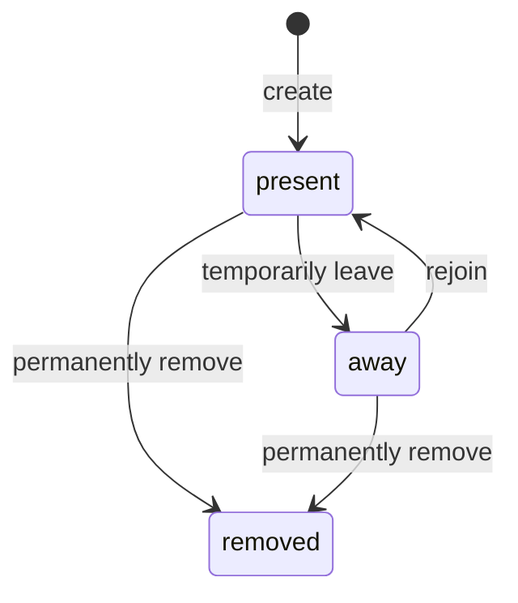
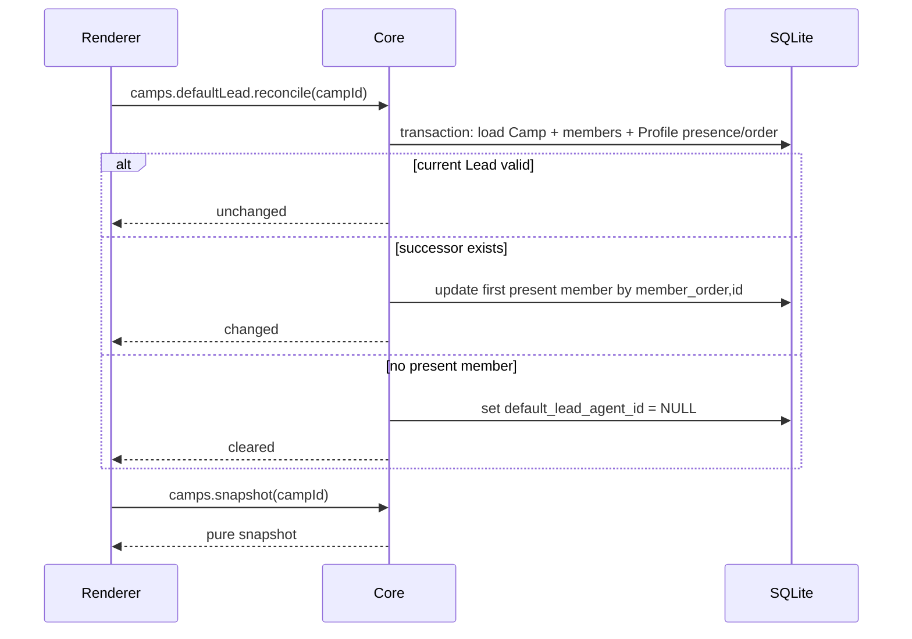

# Rovai-ai v0.15 架构设计

> 版本范围：[README.md](README.md)
>
> 跨版本约束：
> [ADR-0057](../../adr/0057-member-presence-and-retained-removal.md) ·
> [ADR-0058](../../adr/0058-collaboration-v4-presence-aware-admission.md)
>
> UI 约束：[Meridian 详细规范](../../ui/meridian.md)

## 1. 权威边界

v0.15 保持四个独立权威：

| 事实 | 权威 |
|---|---|
| 成员在队/离队/永久移除 | Core SQLite `AgentProfile` Presence |
| Camp membership、Default Lead、Task | 各自 Camp aggregate |
| Runtime 配置和当前健康度 | AgentProfile Runtime preference + AdapterInstallation snapshot |
| 身份、头像、Memory 和历史内容 | 各自既有真源；Presence 不重写正文 |

Renderer 只能展示和提交用户意图，不能通过过滤列表、禁用输入或本地 fallback 创造
领域事实。Core 在每个执行入口重新校验 Presence、Camp scope 和 Runtime 准入。

## 2. AgentProfile Presence

目标合同：

```ts
type MemberPresence = "present" | "away" | "removed";

type AgentProfile = {
  id: string;
  handle: string;
  displayName: string;
  avatarRef: string | null;
  presence: MemberPresence;
  removedAt: string | null;
  runtimePreference: AgentRuntimePreference | null;
  runtimeReadiness: RuntimeReadiness;
  memberOrder: number;
  version: number;
  // existing identity fields unchanged
};
```

状态机：



不存在从 `removed` 离开的边。Runtime 配置和 Readiness 不出现在状态机中。

`runtimeReadiness` 继续区分：

```text
runtime_not_configured
needs_attention
ready
```

不再保留 `profile_inactive/profile_not_present` 这类把成员生命周期塞进 Runtime
状态的值。away Profile 的执行引擎仍可独立显示“未配置／需要检查／已就绪”，但
执行准入另行返回 `member_away`；removed Profile 不进入公开成员读取，也不触发
新的 Runtime 健康探测，执行入口返回 `member_removed`。

## 3. Migration v26

Migration v26 更新 `agent_profile.profile_status` 的合法值并增加 `removed_at`：

```text
active   → present
disabled → away
archived → away
```

目标约束：

```sql
profile_status IN ('present', 'away', 'removed')
AND (
  (profile_status IN ('present', 'away') AND removed_at IS NULL)
  OR
  (profile_status = 'removed' AND removed_at IS NOT NULL)
)
```

物理列可以继续使用 `profile_status` 以降低升级风险，Contracts 和领域代码统一暴露
`presence`。`archived_at` 的既有值逐字节保留为 legacy audit 数据，但不再参与状态
判断，也不再由新命令写入。

Migration 必须：

- 在一个事务中重建约束并迁移所有 Profile；
- 保留 version、updatedAt、handle 唯一索引和所有其他列；
- 不根据是否配置 Runtime 改写 Presence；
- 不扫描或改写 Camp、CampMember、Default Lead、Task、Memory 或 MCP 文件；
- 让新库 Seed 与升级库得到相同 Presence 语义；
- 对重复执行、部分旧 fixture 和约束失败安全回滚。

## 4. 命令与读取合同

### 4.1 Presence 命令

旧 `agents.status.set` 收敛为：

```ts
type SetMemberPresenceCommand = {
  agentProfileId: string;
  expectedVersion: number;
  presence: "present" | "away";
};
```

该命令不再接受 `defaultLeadSuccessors`，也不查询 Camp。目标是 `removed` 或当前值/
版本不匹配时按标准 terminal/version/idempotency 规则处理。

### 4.2 永久移除

```ts
type RemoveMemberCommand = {
  agentProfileId: string;
  expectedVersion: number;
  confirmationHandle: string;
};
```

CoreMethod 使用 `agents.remove`，DomainCommand 使用 `agent_profile.remove`；不继续使用
会暗示数据擦除的 `agents.delete`。

执行事务：

```text
resolve visible Profile + version
→ exact handle confirmation
→ recheck no non-terminal AgentRun
→ UPDATE presence='removed', removed_at=now, version=version+1
→ event + idempotent command result
→ commit
```

不更新其他业务表。用于 Dialog 的 `agents.removalPreview` 只返回同一只读事务中的
Profile version/handle 和非终态 AgentRun blocker；不统计“将删除”的 Memory、
Camp 或历史资产，因为这些数据不会删除。执行命令必须再次检查 blocker。

### 4.3 读取分层

- `agents.list`：只返回 `present | away`。
- 公开 `agents.get`：removed 返回 not found/removed，不提供成员详情。
- 历史身份解析：Core 内部按稳定 ID 读取保留的姓名、角色和 avatarRef。
- Camp snapshot：历史行可以携带 removed identity summary，但活动候选必须显式过滤。
- Member Order 命令只接受当前可管理成员的 ID；Core 使用包含 removed ID 的稳定
  内部顺序完成校验与合并，Renderer 不需要看到 removed。实现必须避免因隐藏行使
  reorder 命令误判或覆盖 removed 的保留 order。

推荐将 reorder 合同改为只提交可见 ID，并由 Core 保持 removed 行的相对/尾部内部
顺序；不得要求 Renderer 回显 removed 身份。

## 5. 活动资格矩阵

| 场景 | present | away | removed |
|---|---:|---:|---:|
| 成员名册/详情 | 是 | 是 | 否 |
| 编辑身份/Runtime | 是 | 是 | 否 |
| 既有 Camp membership 历史 | 保留 | 保留 | 保留 |
| Default Lead 有效候选 | 是 | 否 | 否 |
| 新 Task 指派候选 | 是 | 否 | 否 |
| `@` 活动候选 | 是 | 否 | 否 |
| 新 AgentRun | 继续检查 Runtime | 拒绝 | 拒绝 |
| 已启动 AgentRun | 继续 | 继续 | 移除前必须已终态 |
| Memory 管理数据 | 保留 | 保留 | 保留 |
| Memory 活动投影/Agent 提案目标 | 可适用 | 不适用 | 永久不适用 |
| Runtime/MCP 活动投影 | 可适用 | 不执行 | 永久不执行 |
| 历史身份/头像展示 | 是 | 是 | 是、不可点击 |

## 6. Camp Default Lead 惰性修复

### 6.1 进入流程



有效候选必须同时满足：

```text
current CampMember
AND AgentProfile.presence = present
```

不得检查 Runtime preference 或 Readiness。修复使用最新全局 Member Order，从列表
头选择第一名，不从旧 Lead 位置循环。当前有效 Lead 永远不会仅因 reorder 或更高
顺位成员归队被替换。

`reconcile` 使用 Camp expected version 或事务内 CAS 保证并发安全。重复进入不得重复
推进 version 或产生事件。

### 6.2 Profile 状态变化

离队、归队和永久移除命令不调用 `reconcile`。如果用户在 Camp snapshot 之后改变
Lead Presence，后续提交按 stale/unavailable 拒绝；客户端重新进入/刷新、完成修复
后再由用户重试。Send 命令不得在按键时静默选择新接收者。

## 7. 首页与新 Camp

新对话 Preflight 要同时返回：

- 全部 `present` Profile 的身份和 Runtime 配置/Readiness 摘要；
- 按 Member Order 选出的 `initialLead`；
- 该 Lead 的真实准入 blocker；
- 没有完整 Runtime 配置成员时的 blocker。

选择算法：

```text
first profile by member_order,id
WHERE presence = present
AND runtimePreference is structurally complete
```

选中后不因 Runtime health 失败跳到下一位。显式 `@` 目标仍按消息地址独立校验，但
新 Camp 的持久 Default Lead 使用上述规则。

首页 Composer 不以 `preflight.admissible` 禁用文本框。提交失败由 Core 返回结构化
结果，Renderer 保留草稿并展示 Toast；没有成功事务就不存在 Camp。

## 8. 消息地址与零副作用准入

### 8.1 地址

- Default：只解析持久 Default Lead。
- Explicit：每个 ID/handle 必须属于当前 Camp 且 Profile 是 `present`。
- Broadcast：当前 Camp 全部 `present` 成员。

Runtime 不参与“这个身份是否是地址”，但参与“这次执行能否被接受”。因此提及候选
可以显示未配置或需要检查的在队成员，同时用状态文字说明。

Renderer 只使用一个可展示集合：

```text
visible mention candidates = present Camp members
```

Core 还必须用与 Renderer 相同的 handle 词法规则扫描提交正文，并在 Default
地址生效前查询全局保留 handle 索引。精确匹配到 away、removed 或不属于当前 Camp
的 Profile 时，整次提交明确拒绝；不能因为该身份不在可见候选中就忽略并退化为
Default 地址。Renderer 无需枚举 removed Profile；错误结果只回显用户已经输入的
handle 和结构化 blocker。

### 8.2 原子准入

Core 先解析全部目标，再为每个目标冻结并验证 Runtime。只有：

```text
global blockers empty
AND target list non-empty
AND every target blockers empty
```

才允许创建消息、Turn 和 Runs。任一失败都不落库本次提交的业务对象。Renderer 的
`onSend` 只有在 applied 后才清空草稿；rejected/error 保留文本和选择。

这里的“不落库”指不写 Camp、消息、Turn、Run 或其他业务状态。已经通过认证与
Schema 校验、但被领域准入拒绝的命令，仍按 ADR-0001 原子保存唯一
`command.result(rejected)` 以支持幂等重试；该回执不得复制消息正文、触发 Wake
或产生额外业务事件。

错误至少区分：

- no present Default Lead；
- target away/removed；
- Runtime not configured；
- Runtime needs attention/authentication/install；
- target conversation busy/queued；
- workspace invalid；
- version/address changed。

## 9. AgentRun、Task 与长期数据

### 9.1 AgentRun

away 只阻止新 Run，不向正在运行的外部 Runtime 发送隐式 cancel。removed 命令在
事务内检查该 Profile 的所有非终态 Run；存在 running、waiting、queued 或恢复中
Run 时拒绝。

### 9.2 Task

Task Assignee 是历史责任引用：

- away/removed 不更新 assigneeAgentId；
- 新执行因 Assignee 不可用而拒绝；
- Camp UI 显示“负责人暂时离队”或“负责人已永久移除”；
- 只有用户显式改派、释放或取消 Task。

### 9.3 Runtime、MCP 和 Memory

removed Profile 的 Runtime preference 与 MCP Assignment 保留原数据，但全部活动
投影和引用计数过滤 removed。AdapterInstallation 删除不能被一个不可见 removed
Profile 阻塞。

Memory 数据不自动 retire/forget，也不清除 Revision/Proposal。away/removed
Profile 不是活动 projection/proposal counterparty；removed 永久不恢复适用。历史
和用户治理读取可以解析保留身份，但不能把 Memory 重新注入当前 Agent。

`avatarRef` 保持权威引用，受管最终资产不删除。历史消息通过内部身份读取继续解析
`MemberAvatar`；成员页不提供 removed Profile 修复入口，缺文件时使用既有中性
fallback。

## 10. Read Side 过滤矩阵

实施必须逐项审计，禁止只修改 `agents.list`：

| 读取/命令面 | away | removed |
|---|---|---|
| MemberManagement | 显示离队组 | 过滤 |
| Camp history identity | 显示 | 显示、不可点击 |
| Lead reconcile/picker | 过滤 | 过滤 |
| mention autocomplete | 过滤 | 过滤 |
| mention validation | 识别并拒绝 | 识别并拒绝 |
| Task assignment picker | 过滤 | 过滤 |
| existing Task assignee | 保留并标记 | 保留并标记 |
| Runtime startup requirements | 过滤 | 过滤 |
| MCP/Skill/Memory projection | 过滤 | 过滤 |
| Memory management history | 保留 | 保留 |
| Adapter reference count | 保留配置但不执行 | 不计活动引用 |
| diagnostics/export | 结构化标明 Presence | 结构化标明终态，不伪装已擦除 |

## 11. 成员页 UI

### 11.1 信息架构

桌面使用单一 Member Workbench：

```text
page header: 成员 + 新建成员
└── workbench surface
    ├── roster (在队 / 暂时离队)
    └── detail
        ├── identity portrait + presence action
        ├── role / instructions
        ├── Runtime configuration
        └── permanent removal danger zone
```

不显示 Camp membership 面板，不显示 removed 分组，不显示格言或成员统计卡。

Roster 按 Presence 分组，但拖拽只改变全局 Member Order，不改变 Presence。Runtime
状态单独显示“已就绪／需要检查／未配置执行引擎”，不能通过整行 opacity 降低文字
对比。

### 11.2 详情

- 使用现有 `MemberPortrait`：常规 208×260，窄布局 152×190。
- 标题使用系统无衬线和 Meridian 尺度，不使用辉光、衬线或装饰渐变。
- 身份头按 handle、display name、role/persona、stored roleDescription 排列。
- Presence badge/action 位于身份头附近；离队/归队直接提交并 Toast。
- 指令可以折叠，但正文来自已存 instructions。
- Runtime form 继续由 Adapter descriptors 渲染模型、options 和权限；只中文化文案。
- 永久移除位于页面末尾，Dialog 输入唯一 handle，说明数据保留与活动资格终止。

### 11.3 交互

- Dialog 使用 Radix，具备焦点约束、Escape 和关闭后焦点返回。
- 主题切换只更新主题状态，不重建页面，不丢草稿、焦点、滚动或当前成员。
- Composer/Runtime 错误使用聚焦的状态区或 Toast，不能把整个详情设为
  `aria-live`。
- 遵循 reduced motion；普通文字、焦点环和状态边界达到 WCAG 2.2 AA。
- `1440×920` 与 `1040×700` 下主要生命周期操作、Runtime 保存和危险区可到达，
  不产生整页横向滚动。

## 12. 并发与恢复

- Presence、Runtime、Removal、Lead reconcile 和 Task 改派分别使用自己的 expected
  version/CAS，不共享 Renderer 猜测状态。
- removal preview 不能替代命令内非终态 Run 复查。
- Lead reconcile 后到 snapshot 前发生并发变化时，snapshot 可以显示新状态；提交
  仍必须重新准入。
- Renderer 只在 applied 后移除成员或清空草稿；version conflict 重新加载并要求
  用户重复不可逆确认。
- Core 重启后从 SQLite Presence 恢复全部活动资格；不依赖 UI 缓存或启动扫描改写。

## 13. 验收边界

除单元、Migration、Contract 和 Renderer 测试外，必须从打包 App 验证：

1. 新建无 Runtime 成员仍在队，并可成为既有 Camp 的修复 Lead。
2. 首页跳过无 Runtime 成员，但不跳过已配置却临时不健康的初始 Lead。
3. 离队不改 Camp/Task/Run，进入 Camp 后幂等修复 Lead。
4. 无 Lead、Lead 无 Runtime、多目标一人不可用均保留草稿且零落库。
5. 永久移除受 Run blocker 保护，重启后仍从名册和活动候选消失。
6. 历史消息、Task 和 Run 仍显示 removed 成员原头像与姓名且不可点击。
7. removed Runtime/Memory/MCP 不进入任何当前执行或投影。
8. Day/Night、双尺寸、键盘、Dialog、主题切换和对比度符合 UI 规范。
