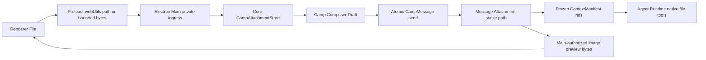

# v0.25 Attachment Composer 生产设计

## 原型取舍

设计输入来自 `design/attachment-composer-prototype` 的 README、design brief 与 HTML。
采用其“无文件选择器、Composer 内横向队列、发送后消息下方纵向冻结、图片 Lightbox”
方向；不采用其假计时器、内存状态、旧 App Shell 和静态演示数据。

## 交互

### 接入

- Textarea 收到含 `File` 的 Paste 时阻止默认行为并逐项准备；普通文本 Paste 不接管。
- 拖拽反馈只覆盖 Composer，不改变整个 Camp 阅读区。
- 一次可接入多个文件，保持用户选择顺序。队列即时显示“正在安全接入…”。
- 安全接入包括复制、SHA-256 和有限文件头检查。UI 不承诺完整病毒扫描。

### 队列

- Composer 顶部显示 52px 横向附件卡，超宽时局部横向滚动。
- 图片卡显示安全预览；其他卡显示文件类型、名称和大小。
- `preparing` 和 `error` 阻止整条消息发送。失败项保留本地错误卡，用户移除后可发送。
- Ready 项可逐个移除；移除同时更新 Core Draft 和文件所有权。

### 发送与恢复

- Enter 发送、Shift+Enter 换行规则不变。
- 正文为空、Draft 未加载、存在 preparing/error、已有执行或全局提交 busy 时不能发送。
- 成功后正文与附件队列一起清空；失败后保持原样。
- 切换 Camp 或重启时恢复该 Camp 的正文与有序 Ready 附件。

### 时间线与预览

- 消息正文之后按纵向卡片显示冻结附件，不把附件混入正文 Markdown。
- 安全图片卡可通过鼠标或键盘打开 Radix Lightbox；Escape 关闭并返回焦点。
- Renderer 只收到预览 bytes 和 media type，不接收或展示绝对路径。
- 预览不可用时退回通用文件卡，消息和 Agent 读取不受影响。

## 安全与数据流

- Disk-backed `File` 由 Preload 使用 Electron `webUtils.getPathForFile` 转换；Renderer
  本身不获得路径。
- 剪贴板生成的内存 `File` 通过有界 bytes 进入 Main 私有临时文件，Core 完成复制后
  立即删除临时文件。
- Core 仅接受普通文件，目标名称规范化，最终文件只读。
- Camp 根目录不可枚举；Runtime 只能使用 Context 中已经公开的稳定路径。

## 限制

| 项目 | 限制 |
|---|---:|
| 单条消息附件数 | 10 |
| 单文件 | 25 MiB |
| Draft 总附件 | 64 MiB |
| Renderer 图片预览 | 8 MiB |
| 最大图片边长 | 16,384 px |
| 最大图片像素 | 40,000,000 |
| Draft 闲置保留 | 7 天 |

## 文件识别

- PNG/JPEG/WebP/GIF：只读取必要文件头与尺寸；满足预览限制才标记 `image`。
- SVG、HTML、脚本、可执行文件和未知二进制：作为普通数据文件，不在 Renderer 执行
  或渲染。
- PDF、ZIP 与 UTF-8 文本只用于卡片类型提示，不进行深度解析。
