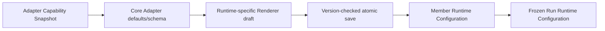

# v0.26 Member Runtime Parameters 生产设计

## 页面结构

“Agent运行时”继续只展示 Product Runtime 和真实可用性。在运行时摘要下增加
`
` 形式的“运行参数”，默认收起；选择 Runtime 后才显示。折叠区与
“高级设置”是两个独立区域，前者属于成员执行配置，后者继续只承载 Camp 共享摘要模型。

表单使用一个保存操作提交 Product Runtime、模型和权限草稿。切换 Runtime 立即在本地
丢弃旧草稿并载入新 Runtime 默认值，但保存成功前不改变数据库。无 ready snapshot
时折叠区显示普通说明，不虚构模型或权限。

## 模型交互

- “模型策略”包含“跟随 Runtime 默认”和“固定模型”。
- 跟随默认时隐藏模型选择与全部模型参数。
- 固定模型只列出 snapshot 中未隐藏、未废弃且不是 synthetic runtime-default 的模型。
- 选择模型后，只显示对应 Runtime 认识且该模型实际报告的参数。
- 参数没有 Runtime 默认值时提供“跟随模型默认值”，保存时不写该 option。
- 已保存但失效的值以普通失效选项显示，用户必须重新选择后才能保存。

## Runtime 专用字段

| Runtime | 控件 |
|---|---|
| Codex CLI | 模型；推理强度；文件系统访问；审批策略 |
| OpenCode | 模型；可选推理强度；工具权限 |
| GitHub Copilot CLI | 模型；可选推理强度；“自动允许全部操作”开关 |
| Claude Code | 模型；思考强度；权限模式 |
| Kiro CLI | 模型策略与模型 |
| Qoder CLI | 能力存在时的模型/推理强度；权限模式 |
| CodeBuddy | 能力存在时的模型/推理强度；权限模式 |
| Qwen Code | 能力存在时的模型/推理强度；审批模式 |
| Antigravity | 模型；执行模式；终端沙箱；“自动通过权限请求”开关 |

所有原生值原样保存。特别是 CodeBuddy 的 `bypassPermissions` 与 Qoder 的
`bypass_permissions` 不共享转换逻辑。

## 数据与校验

- Core 返回基于当前 snapshot 校验过的成员默认配置。
- Renderer 只渲染专用组件认识的字段。
- Core 在事务中重新读取 ready Managed Default Installation 和 snapshot。
- 模型与权限必须同时通过；失败不修改任何持久成员字段。
- Runtime 未就绪且草稿不含模型/权限时，只保存 `AdapterKind`。
- 后台探测只更新 Installation/snapshot，不完成成员配置。

## 状态与可访问性

- 折叠按钮可键盘操作并具有明确“运行参数”名称。
- 下拉框和开关都使用普通 Arctic Dawn 表单样式，不显示风险等级。
- missing、checking、needs-attention 和 invalid 使用文字解释，不只依赖颜色。
- 提交期间禁用整个 Runtime 表单；失败保留本地草稿和焦点。
- 普通页面不渲染 Installation ID、路径、fingerprint、auth scope 或探测详情。
