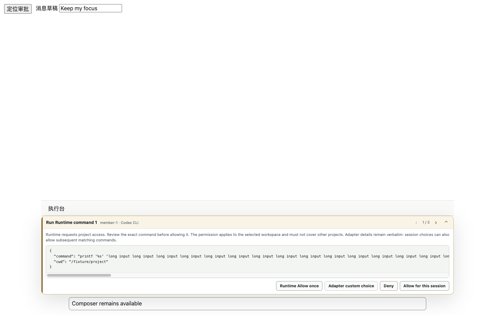
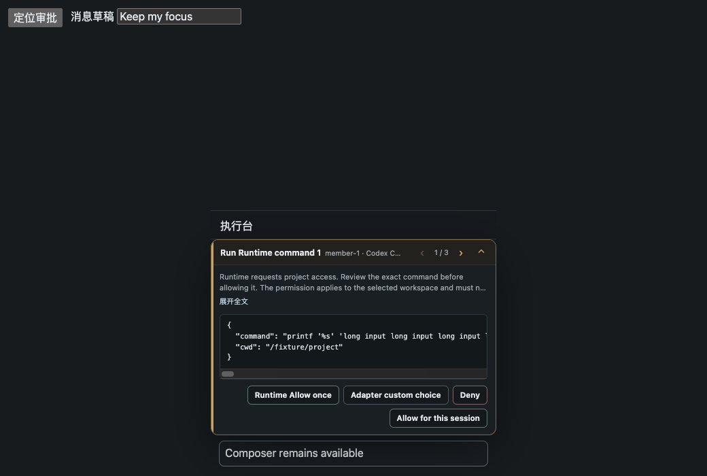

# Approval Dock interaction fixture

The fixture mounts the production `ApprovalDock` and stylesheet with synthetic approvals.
It exercises native mouse/keyboard input, notification focus, decision identity and Reason
overflow under layout changes. It uses isolated temporary Electron data and never starts Core
or a Runtime. The surrounding controls and execution-console shell are test scaffolding.

Run `pnpm test:approval-dock`. Set `ROVAI_KEEP_APPROVAL_FIXTURE=1` to retain the temporary
screenshots; Linux requires `xvfb-run -a`. Assertions are the regression authority; the
screenshots below are review evidence captured on macOS on 2026-08-31.

