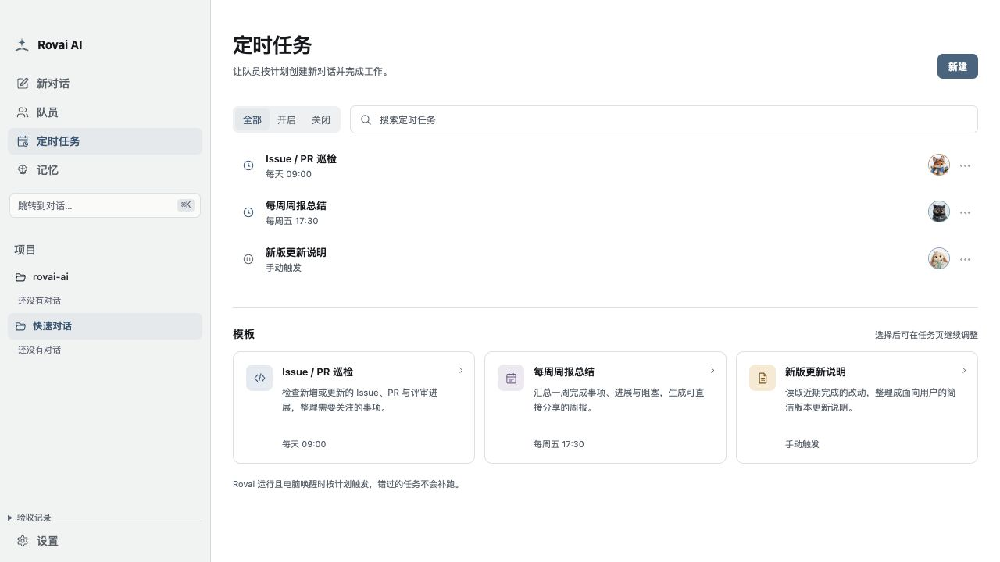
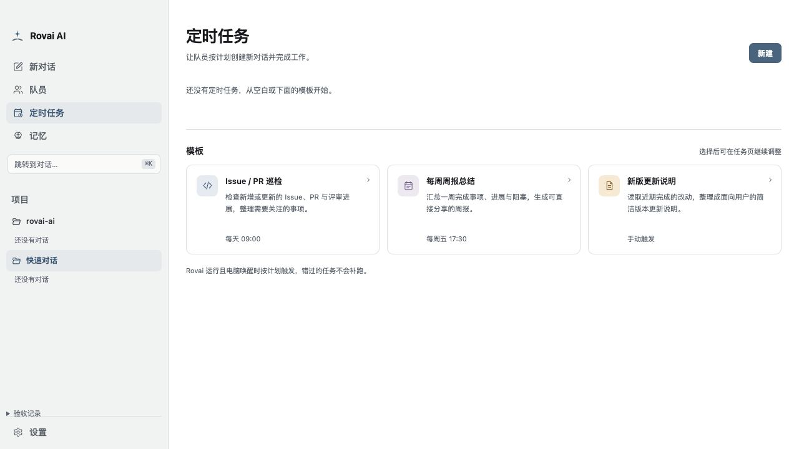
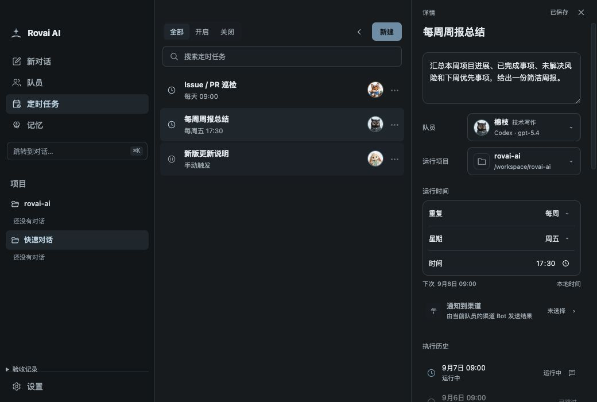

# 定时任务 Renderer 验收场景

挂载生产 `AutomationWorkspace`、`CampNavigation` 和主题样式，RPC 使用确定性的内存数据。
不启动 Core、Electron 或模型，不读写日常用户目录。执行对话入口显示收到的 Camp ID；它只证明 Renderer 路由参数，
不替代真实 Camp activation、Runtime 或渠道投递验收。

```bash
node scripts/fixtures/automation-workspace/serve.mjs
pnpm exec tsc -p scripts/fixtures/automation-workspace/tsconfig.json
```

打开服务输出的本地链接。默认包含三项定义与每项 24 条运行记录；查询参数 `empty`、`no-members`、`theme=night`、
`load-failure`、`save-failure`、`conflict` 分别提供空列表、无队员、夜间、一次读取失败、一次保存失败和版本冲突。
左下角“验收记录”可以检查管理命令，不将测试控件带入产品。

2026-09-07 通过浏览器真实输入验证：

- 已有任务与空列表均首先进入总览，没有自动打开编辑器；开启/关闭筛选与名称搜索正确。
- 从空白、总览模板进入新建；空白 Prompt 禁用创建；模板正确预填周五 17:30。
- Cron 和单次日期控件切换、已发布飞书 Bot 选择、未发布钉钉禁选、创建后进入详情。
- 编辑后立即返回总览会先保存；失败保留草稿，重试成功；冲突阻止离开，“保留草稿并重试”使用新版本保存。
- 历史从 20 条展开到 24 条，无重复分页按钮；无 Camp 的跳过行禁用，失败运行可以打开执行对话。
- 分隔条 End 收起 / Enter 恢复，最小窗口 1040×700 与 720×460（200% 等效布局）无横向溢出。
- Day/Night 使用相同产品结构与语义颜色。下方是渲染截图，不代表原生 App 或真实模型执行已经验收。




