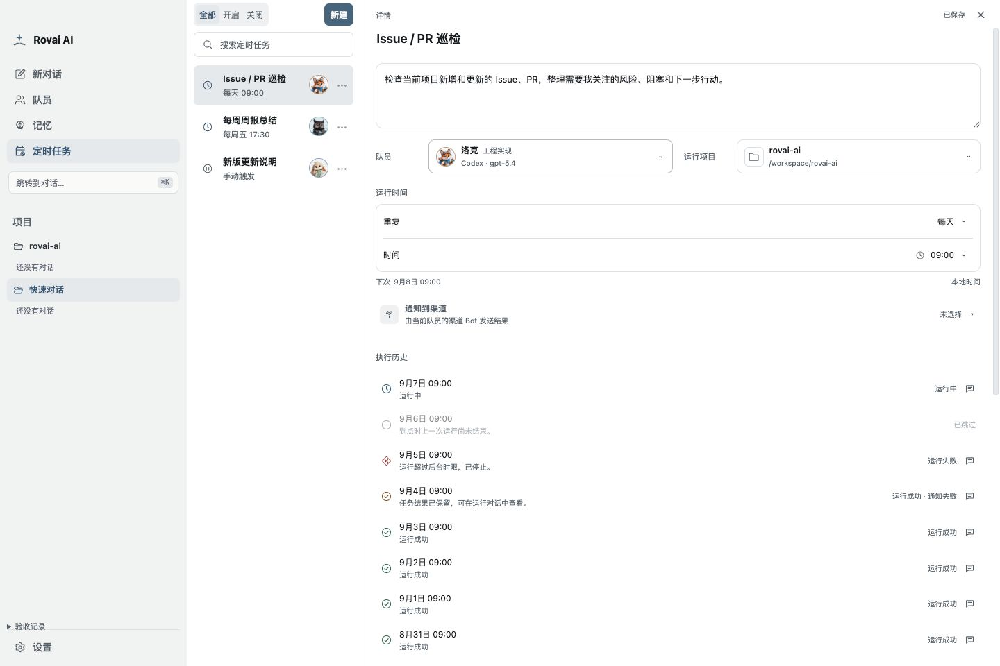
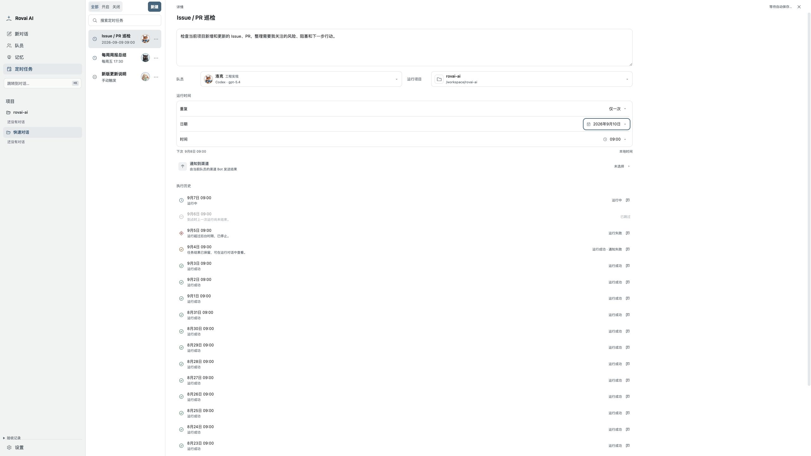
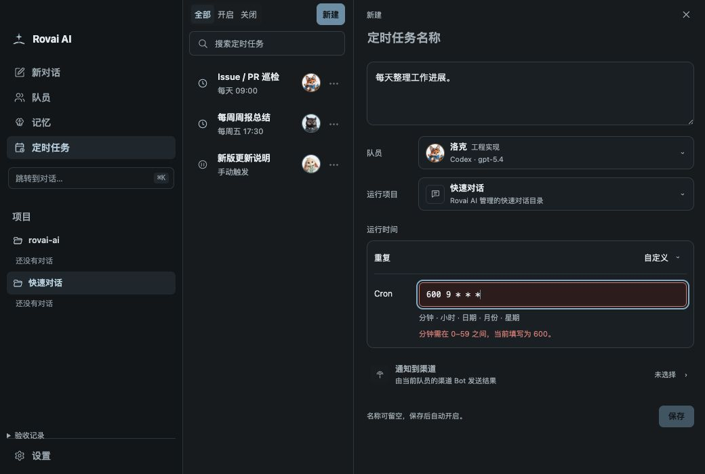

# 定时任务 Renderer 验收场景

挂载生产 `AutomationWorkspace`、`CampNavigation`、`WindowDragStrip` 和主题样式，RPC 使用确定性的内存数据。
不启动 Core、Electron 或模型，不读写日常用户目录。执行对话入口显示收到的 Camp ID；它只证明 Renderer 路由参数，
不替代真实 Camp activation、Runtime 或渠道投递验收。

```bash
node scripts/fixtures/automation-workspace/serve.mjs
pnpm exec tsc -p scripts/fixtures/automation-workspace/tsconfig.json
```

打开服务输出的本地链接。默认包含三项定义与每项 24 条运行记录；查询参数 `empty`、`no-members`、`theme=night`、
`load-failure`、`save-failure`、`conflict` 分别提供空列表、无队员、夜间、一次读取失败、一次保存失败和版本冲突。
左下角“验收记录”可以检查管理命令，不将测试控件带入产品。

2026-09-07 通过浏览器真实输入验证：

- 已有任务与空列表均首先进入总览，没有自动打开编辑器；开启/关闭筛选与名称搜索正确。
- 从空白、总览模板进入新建；空白 Prompt 禁用创建；模板正确预填周五 17:30。
- Cron 和单次日期控件切换、已发布飞书 Bot 选择、未发布钉钉禁选、创建后进入详情。
- 编辑后立即返回总览会先保存；失败保留草稿，重试成功；冲突阻止离开，“保留草稿并重试”使用新版本保存。
- 历史从 20 条展开到 24 条，无重复分页按钮；无 Camp 的跳过行禁用，失败运行可以打开执行对话。
- 分隔条 End 收起 / Enter 恢复，最小窗口 1040×700 与 720×460（200% 等效布局）无横向溢出。
- 按后续反馈把列表初始宽度设为最小 208px：方向键放宽后双击回到 208px；顶部筛选、返回与新建在同一行完整可见，
  按钮距页面顶部 5–7px，没有预留空白标题行。Day 1280×720 与 Night 1040×700 截图已更新。
- Day/Night 使用相同产品结构与语义颜色。下方是渲染截图，不代表原生 App 或真实模型执行已经验收。

2026-09-08 v34 落地后通过浏览器真实输入复核：

- 入口已恢复，初始总览最大 1136px 居中，与记忆页页眉一致；已有任务、空列表均不自动打开详情。
- `accept-create.mjs` 验证包含窗口拖拽层时详情顶部“新建”能够命中，直接打开空白草稿，填写后“保存”成功进入已有任务。
- 2K（2560×1440）详情表单、运行时间、通知和历史等宽 1440px，队员/项目各占 712px。
- 1440px 时队员/项目并排；1140、1100、1040px 时各占一行，选择框右边缘与 Prompt 一致；720px 显示单一编辑器，无横向溢出。
- 输入 `600 9 * * *` 后立即标记错误，新建保存禁用；已有任务保留草稿并阻止离开，验收记录无更新命令。
  改为 `0 9 * * *` 后保存恢复，离开前只发出有效表达式的更新。
- 时间直接输入 23:55 后分钟加五变为 00:00；日历默认聚焦选中日期，右方向键移动到翌日，Enter 选择并收起。
- 保存失败保留草稿，重试后可返回总览；版本冲突阻止离开，“保留草稿并重试”成功保存。
- 生产类型检查、fixture 类型检查、3 文件 182 项 Vitest、桌面 production build 和文档门禁通过。

以下截图更新到本轮生产 Renderer。这里的内存 RPC 不替代真实 Core、Runtime 或通知投递验收。

2026-09-08 创建选择框还原后，`accept-create.mjs` 通过浏览器真实输入验证：

- 列表“新建”先展开空白与三个模板入口，选定之前保留当前详情；空白可保存，三个模板正确预填名称、内容与计划。
- 再次点击、框外点击与 Escape 均可收起；Escape 返回“新建”，直接点击已有任务仍能完成切换。
- 选择空白或模板不聚焦输入框；208px 最小列表在 1040×700 夜间窗口下没有横向溢出。
- 总览副标题为“安排一次，按时执行。”，已去掉运行与唤醒条件提示；2K 空列表保持 1136px 居中，点击总览“新建”后铺满导航右侧。

下方截图保留 v34 记录；新建选择框与文案以当前生产组件和上述回归为准。






