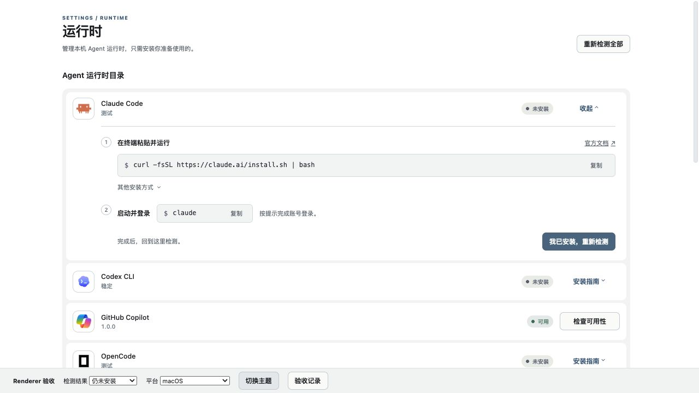

# Runtime 安装引导 Renderer 验收

挂载生产 `RuntimeInstallationsPanel`、安装引导组件和共享主题样式。使用内存 RPC 与明确标记的
平台资格数据，不启动 Electron、Core、真实 Runtime，不读取或写入日常用户目录，不执行安装命令。
夹具中的 Windows 已准入选项仅用于证明平台分支，不代表真实 Windows Runtime 资格。

```bash
node scripts/fixtures/runtime-install-guide/serve.mjs
pnpm exec tsc -p scripts/fixtures/runtime-install-guide/tsconfig.json
```

打开服务输出的链接。底栏选择下一次检查结果、切换平台或主题；“验收记录”展示调用顺序和复制内容，
点击记录关闭。状态均由内存请求结果驱动。该夹具证明 Renderer 行为，不替代真实软件安装、登录、
系统剪贴板和外部浏览器集成验收。

2026-09-07 使用浏览器交互验证：

- 默认收起；Claude、Codex、OpenCode 均有安装与启动步骤；切换产品只展开一行。
- 命令复制显示“已复制”，夹具收到完整命令；其他安装方式展开后可见 Homebrew/npm 前置条件。
- 安装后先等待 `runtime.discovery.rescan`，再调用选中产品的 `runtime.product.check`；登录后只调用后者。
- 检查中按钮不可重复触发，完成后焦点仍在当前检测按钮；未安装、需要登录、可用结果保持真实状态。
- 请求失败保留指南与重试入口；运行环境失败保留公共错误来源、摘要和详情。
- Windows 未验证时无安装／登录指南，检测按钮禁用；已准入的非 macOS 平台仅链接官方说明。
- Day/Night 布局一致；720×460 放大等效布局中页面宽度与滚动宽度均为 720px，指南宽度与滚动宽度均为 634px。



